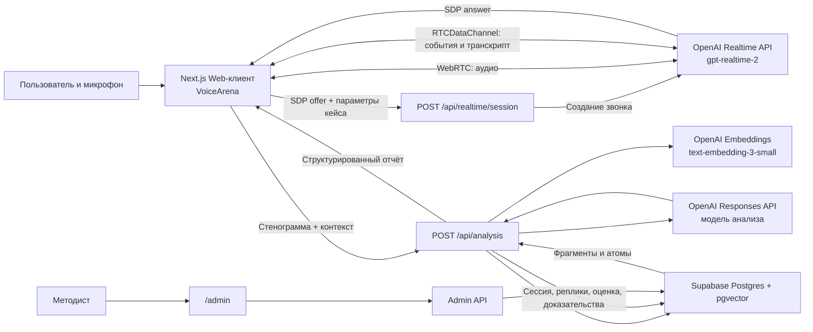
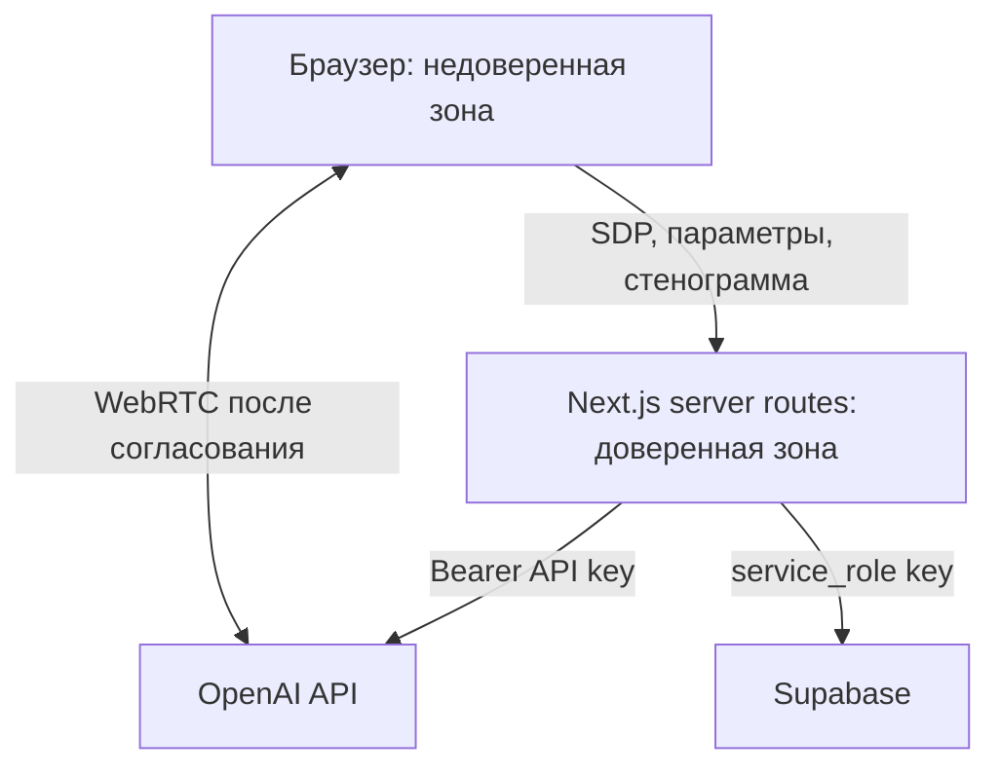

# KORUS NEGA AI — голосовой тренажёр переговоров

KORUS NEGA AI — русскоязычный тренажёр управленческих переговоров. Пользователь ведёт голосовой диалог с ИИ-оппонентом, получает живую расшифровку, а после завершения — структурированный разбор по методической базе: результат поединка, персональную обратную связь, разбор приёмов, доказательства и план развития.

Репозиторий содержит работающий прототип. В нём реализованы библиотека загружаемых кейсов, AI-конструктор управленческих поединков, два голоса оппонента, голосовой диалог через OpenAI Realtime API, RAG-анализ по книге Владимира Тарасова и закрытая панель проверки методических атомов.

## Возможности

- двусторонний голосовой разговор в браузере через WebRTC;
- естественное определение конца реплики (`semantic_vad`) и перебивание оппонента;
- русская расшифровка реплик пользователя и ИИ в реальном времени;
- измерение задержки от конца реплики пользователя до начала ответа;
- выбор женского (`marin`) или мужского (`cedar`) голоса;
- умный голос по умолчанию: каноническая роль содержит `voiceGender`, поэтому после выбора роли участника автоматически включается голос противоположной роли, которую играет ИИ; ручной выбор запоминается отдельно для конкретного ИИ-персонажа и не блокирует корректный автовыбор при переходе к другому оппоненту;
- канонический кейс поддерживает от двух до четырёх ролей; при выборе роли пользователя одна из остальных ролей случайно назначается ИИ-оппонентом, после чего её голос и полный Realtime-промпт фиксируются до следующей смены роли или кейса;
- после быстрой канонизации или утверждения варианта запускается идемпотентный фоновый медиаконвейер: четыре общих комикс-кадра через `gpt-image-2`, отдельные подписи и аудиорассказ через Speech API для каждой роли, загрузка в приватный Supabase Storage и атомарная публикация только полностью готовой версии пакета;
- `/api/cases/[id]/comic` возвращает статус подготовки и временные подписанные ссылки на персональную версию выбранной роли; интерфейс показывает состояние подготовки, автоматически опрашивает готовность и затем запускает пролог без ожидания генерации;
- подписанные изображения из приватного Supabase Storage выводятся напрямую без проксирования через Next Image Optimizer, чтобы токен ссылки сохранялся полностью и закрытые WEBP стабильно отображались;
- предпросмотр полного содержания выбранного кейса до старта поединка и его серверное озвучивание тем же выбранным голосом;
- тестовый четырёхкадровый комикс-пролог для кейса «Сорванный срок проекта»: покадровая навигация, подписи поверх изображений и автоматическое последовательное озвучивание сцен голосом `marin` или `cedar`; восемь аудиодорожек подготовлены заранее и предзагружаются при открытии комикса, поэтому переход между сценами не ждёт Speech API; после пролога доступно полное каноническое описание;
- выпадающий список опубликованных кейсов; публичные API никогда не возвращают скрытые мотивы ни одной роли, а Realtime-сервер получает их непосредственно из опубликованной записи Supabase;
- выбор любой из двух ролей канонического кейса: участник видит цели, интересы и ограничения обеих сторон, а Realtime-модель автоматически получает противоположную роль;
- левая панель с быстрым переходом к переговорам, личному кабинету, рейтингу, админ-панели, загрузке и созданию кейса;
- быстрая загрузка одного файла с автоматическим приведением к каноническому виду и публикацией в библиотеке кейсов;
- отдельный раздел `/cases` для накопления описания и нескольких материалов, повторного AI-анализа и выбора одного из двух конфликтных сценариев;
- поддержка TXT, MD, CSV, JSON, XML, HTML, RTF, PDF и DOCX; текстовые файлы распознаются как UTF-8, UTF-8 с BOM, UTF-16 или Windows-1251, учитываются XML/HTML-декларации и RTF escape-последовательности; оригиналы хранятся в закрытом Supabase Storage, извлечённый текст — в Postgres;
- имена объектов Supabase Storage транслитерируются в безопасный ASCII-ключ, а исходное русское имя нормализуется в Unicode NFC, очищается от управляющих/Bidi-символов, сохраняется отдельно в базе и показывается пользователю;
- генерация сценариев по проверенным методическим атомам: две роли, несовместимые интересы, значимые ставки и отсутствие очевидного решения, полностью устраивающего обе стороны;
- канонизация требует двух персонифицированных сторон: у каждой обязательно есть реалистичные имя и фамилия в поле `name`, а должность и организационная роль хранятся отдельно в `position`; безымянный вариант нельзя утвердить и опубликовать;
- нативные выпадающие меню выбора кейса и роли используют тёмную цветовую схему: пункты отображаются светлым текстом на тёмном фоне;
- стартовый блок с кнопкой «Содержание кейса» расположен в верхней части рабочей области и компактно связан с панелью ожидающего аудиоввода, без больших пустых разрывов до полезной информации;
- отдельный глубокий анализ после завершения разговора;
- поиск релевантных фрагментов методологии через embeddings и pgvector;
- оценка результата переговоров по строгой JSON-схеме;
- проверка цитат: вывод сохраняется только тогда, когда цитата действительно есть в стенограмме и методическом источнике;
- сохранение сессии, реплик, оценки и доказательств в Supabase;
- закрытая админ-панель для подтверждения, отклонения и редактирования методических атомов;
- выпуск проверенной версии методологии `tarasov-v1`;
- хранение постоянных API-ключей только на сервере;
- персональная регистрация и вход через Supabase Auth по корпоративной почте и паролю; самостоятельно зарегистрироваться могут только сотрудники с адресами `@korusconsulting.ru` и `@mons.ru`;
- личный кабинет с датой регистрации, последним поединком, количеством тренировок, долей побед и тремя наиболее часто сыгранными кейсами;
- общий рейтинг участников с количеством поединков, побед, долей побед, датой последнего поединка и динамической сортировкой по трём числовым показателям;
- подписанная HTTP-only cookie пользовательской сессии закрывает страницы и серверные API от неавторизованных посетителей.

## Текущий статус и ограничения

Это прототип, а не завершённая многопользовательская платформа.

- В базе есть исходный кейс «Сорванный срок проекта» с участниками Ириной Соколовой и Алексеем Воронцовым; новые кейсы можно добавлять быстрой загрузкой или через конструктор.
- Для исходного проверочного кейса используется заранее утверждённый встроенный медиапакет. Для новых загруженных и созданных кейсов медиапакет генерируется автоматически после публикации; до готовности пользователь может открыть полное текстовое содержание.
- Роль пользователя, сложность, таймер и стиль переговоров пока отображаются в интерфейсе, но не редактируются.
- Роль администратора в `user_profiles` зарезервирована, но управление пользователями и выдача администраторских прав ещё не реализованы; существующая панель методиста по-прежнему защищена отдельным общим админ-паролем.
- Конструктор кейсов пока общий для всех авторизованных участников: владельцы черновиков, квоты и удаление материалов ещё не реализованы.
- Поединки, созданные до персональной авторизации, остаются без владельца и не входят в личную статистику или рейтинг.
- За один анализ принимается до 6 файлов общим размером до 4 МБ; один файл — до 3 МБ. Старый бинарный формат `.doc` не поддерживается, используйте `.docx`.
- Аудио не сохраняется; сохраняются текстовые реплики и результаты анализа.
- Админ-доступ общий, по паролю из переменной окружения.
- Все операции Supabase выполняются серверным клиентом с `service_role`; публичного клиентского доступа к базе нет.
- Оригинал книги не входит в Git-репозиторий. Он хранится локально и в приватном Supabase Storage.
- 34 методических атома временно подтверждены владельцем для работы прототипа как `tarasov-v1`. Перед коммерческим использованием необходима полноценная экспертная перепроверка.

Проектное видение следующих этапов находится в [docs/ARCHITECTURE.md](docs/ARCHITECTURE.md), а сведения об источнике — в [docs/SOURCE_MANIFEST.md](docs/SOURCE_MANIFEST.md). Этот README описывает прежде всего фактически реализованную систему.

## Архитектура

### Общая схема



Архитектура разделяет быстрый голосовой контур и более медленный аналитический контур. Во время разговора модель не выполняет поиск по книге и не строит большой отчёт — это уменьшает задержку. RAG и reasoning запускаются только после завершения сессии.

### Авторизация и пользовательская статистика

`/register` создаёт подтверждённую учётную запись Supabase Auth и связанную запись `user_profiles`. Сервер повторно проверяет имя, фамилию, длину пароля и точное совпадение домена корпоративной почты. `/login` проверяет пару почта/пароль через Supabase Auth, после чего приложение выдаёт подписанную HMAC-SHA256 HTTP-only cookie на семь дней. Пароль и access token Supabase в cookie не сохраняются.

При сохранении анализа `training_sessions.user_id` заполняется идентификатором текущего участника. `/account` агрегирует его сессии и результаты `evaluations`, а `/rating` выполняет такую же агрегацию по всем обычным пользователям. Победой считается только результат анализа с `outcome.winner = "user"`; ничья и победа оппонента увеличивают число поединков, но не число побед.

### 1. Клиентский слой

Основной интерфейс реализован в `src/components/VoiceArena.tsx` и подключён на главной странице `src/app/page.tsx`.
Единая компактная панель навигации для тренажёра, кабинета, рейтинга, кейсов и админ-раздела реализована в `src/components/AppNavRail.tsx`.

`VoiceArena` отвечает за:

- запрос доступа к микрофону через `navigator.mediaDevices.getUserMedia`;
- создание `RTCPeerConnection`;
- отправку микрофонного аудиотрека в Realtime API;
- воспроизведение удалённого аудиотрека модели;
- обработку событий через канал `oai-events`;
- сбор пользовательских и модельных транскриптов;
- отображение состояний «готов», «подключение», «в эфире» и ошибок;
- компактную область диалога с внутренней прокруткой реплик и постоянным расположением кнопок запуска/завершения сразу под диалогом, до итогового отчёта;
- фиксацию длительности разговора и приблизительной задержки ответа;
- отправку итоговой стенограммы на `/api/analysis`;
- отображение структурированного отчёта.

Клиент не получает `OPENAI_API_KEY`, `SUPABASE_SERVICE_ROLE_KEY` и скрытые мотивы персонажей. Идентификаторы ролей передаются серверу, но канонический контекст, цели, ограничения и закрытые параметры сервер повторно загружает из опубликованного кейса.

### 2. Голосовой контур Realtime

Маршрут `src/app/api/realtime/session/route.ts` работает как небольшой BFF между браузером и OpenAI.

Последовательность открытия сессии:

1. Клиент создаёт локальный WebRTC offer.
2. Клиент отправляет SDP на `POST /api/realtime/session` вместе с идентификатором кейса, индексами выбранных ролей, сложностью и голосом.
3. Сервер загружает опубликованный кейс, проверяет SDP и индексы ролей и формирует инструкции через `src/lib/prompt.ts`; переданные клиентом описания роли и контекста не считаются источником истины.
4. Сервер создаёт Realtime call запросом к `https://api.openai.com/v1/realtime/calls`, используя секретный API-ключ.
5. OpenAI возвращает SDP answer, который сервер пересылает браузеру.
6. После установления соединения аудио идёт напрямую между браузером и OpenAI по WebRTC.
7. Транскрипты, состояния речи и служебные события передаются через `RTCDataChannel`.

Параметры голосовой модели:

| Параметр | Значение |
|---|---|
| Модель | `gpt-realtime-2` |
| Формат ответа | аудио |
| Reasoning | `low` |
| Транскрибация | `gpt-realtime-whisper`, язык `ru` |
| Определение реплики | `semantic_vad` |
| Автоматический ответ | включён |
| Перебивание ответа | включено |
| Голоса | `marin`, `cedar` |

`GET /api/realtime/session` выполняет простую проверку наличия `OPENAI_API_KEY` и возвращает `503`, если ключ не настроен.

### 3. Аналитический контур

После нажатия «Завершить» клиент отправляет на `POST /api/analysis`:

- идентификатор/код кейса и индексы выбранных ролей;
- выбранный голос оппонента;
- время начала и длительность;
- до 80 последних реплик.

Маршрут анализа выполняет следующие этапы:

1. Загружает опубликованный кейс и канонические роли из Supabase; для встроенного кейса использует серверную константу.
2. Проверяет, что есть минимум две содержательные реплики и хотя бы одна реплика пользователя.
3. Строит embedding контекста и стенограммы моделью `text-embedding-3-small`.
4. Вызывает Supabase RPC `match_method_chunks` и получает до восьми фрагментов с cosine similarity не ниже `0.3`.
5. Загружает связанные методические атомы и статус версии методологии.
6. Передаёт кейс, стенограмму, атомы и найденные фрагменты в OpenAI Responses API.
7. Требует ответ по строгой JSON Schema из `src/lib/analysis-types.ts`.
8. Повторно валидирует доказательства на сервере: цитаты должны дословно присутствовать в доступном корпусе и стенограмме, а идентификаторы атомов — существовать.
9. Сохраняет сессию, реплики, оценку и прошедшие проверку доказательства в Supabase; при ошибке компенсирующе удаляет всю незавершённую запись сессии.
10. Возвращает клиенту готовый отчёт.

Модель анализа задаётся через `OPENAI_ANALYSIS_MODEL`; значение по умолчанию — `gpt-5.4-mini`, reasoning effort — `medium`.

Итоговая структура `NegotiationAnalysis` содержит:

- общий балл от 0 до 100;
- победителя: пользователь, оппонент или ничья;
- краткий вердикт и причины;
- персональную обратную связь;
- детализацию баллов по критериям;
- сильные стороны и риски;
- поворотные моменты;
- обнаруженные, возможные и упущенные приёмы;
- альтернативные формулировки;
- план развития;
- цитаты-доказательства и уровень уверенности;
- версию и статус методологии.

### 4. Методическая база и RAG

Исходный FB2-файл обрабатывает `scripts/ingest-methodology.mjs`.

Конвейер импорта:

1. Читает источник по пути `METHODOLOGY_SOURCE_PATH`.
2. Вычисляет SHA-256 для контроля версии файла.
3. Читает кодировку из BOM или XML-декларации (UTF-8, UTF-16, Windows-1251), затем извлекает заголовки и абзацы из FB2/XML.
4. Формирует смысловые фрагменты размером примерно до 3200 символов.
5. Загружает оригинал в приватный bucket `methodology-sources`.
6. Создаёт embeddings и записывает фрагменты в `document_chunks`.
7. При запуске с `--extract-atoms` выбирает релевантные фрагменты и извлекает кандидаты в атомарные правила через Responses API.
8. Сохраняет только те атомы, чья `sourceQuote` дословно найдена в исходном фрагменте.

Обычный импорт идемпотентен: источник сопоставляется по SHA-256, а фрагменты — по паре `source_id + chunk_index`.

Методический атом имеет тип `principle`, `stratagem`, `case_rule`, `evaluation_criterion` или `example`, а также формулировку, сигналы, контрпримеры, исходную цитату, версию и статус проверки.

### 5. Админ-панель методиста

Админ-панель доступна по адресу `/admin`.

- `/admin/login` — форма входа;
- защищённый layout проверяет cookie сессии;
- `/admin/methodology` — просмотр и проверка атомов;
- `POST /api/admin/login` — сверка пароля и установка cookie;
- `POST /api/admin/logout` — завершение сессии;
- `PATCH /api/admin/methodology/[id]` — редактирование и смена статуса атома;
- `POST /api/admin/methodology/release` — выпуск версии `tarasov-v1`.

Сессионный токен подписан HMAC-SHA256, хранится в `HttpOnly`, `SameSite=Strict` cookie и действует 12 часов. В production cookie также получает флаг `Secure`. Для выпуска `tarasov-v1` не должно остаться атомов со статусом `candidate`, а подтверждённых атомов должно быть не меньше десяти. Изменение атома после выпуска возвращает источник в предварительный статус до следующего релиза.

Это простая защита прототипа. Для многопользовательской эксплуатации её следует заменить полноценной аутентификацией и ролевой моделью.

### 6. Хранилище данных

Миграции в `supabase/migrations/` создают расширение pgvector, приватные Storage bucket, RPC векторного поиска и атомарного утверждения кейса, а также версионированные задания медиаконвейера.

| Таблица | Назначение |
|---|---|
| `method_sources` | Источник методологии, хеш, путь в Storage, версия и статус проверки |
| `document_chunks` | Фрагменты книги, иерархия разделов и embeddings размерности 1536 |
| `method_atoms` | Атомарные правила, цитаты и решения методиста |
| `user_profiles` | Имя, фамилия, корпоративная почта, роль и дата регистрации участника |
| `training_sessions` | Метаданные проведённых тренировок и ссылка на участника |
| `turns` | Последовательность реплик пользователя и оппонента |
| `evaluations` | Полный JSON результата и сводные поля оценки |
| `evaluation_evidence` | Связь вывода с репликой, цитатой источника и уверенностью |

Для векторного поиска используется HNSW-индекс и cosine distance. На таблицах включён RLS, но права выдаются только `service_role`; серверный ключ никогда не должен попадать в клиентский код.

### 7. Границы доверия и безопасность



Основные меры:

- секреты читаются только серверными модулями с `server-only`;
- SDP и пользовательские строки ограничиваются и проверяются;
- голосовой промпт требует сохранять роль и не раскрывать инструкции;
- аналитическая модель получает только извлечённые фрагменты, а не полагается на память о книге;
- JSON Schema ограничивает форму результата;
- цитаты дополнительно проверяются программно до сохранения;
- админские изменяющие запросы требуют подписанную сессию и проверяют origin;
- оригинал книги хранится в приватном bucket и не коммитится в Git.

Текущие ограничения безопасности: отсутствуют rate limiting, управление пользователями, самостоятельное восстановление пароля, ограничение кейсов по владельцам и аудит действий администратора.

## Структура проекта

```text
src/
├── app/
│   ├── page.tsx                         # главная страница тренажёра
│   ├── globals.css                      # стили интерфейса
│   ├── api/
│   │   ├── realtime/session/route.ts    # создание WebRTC Realtime-сессии
│   │   ├── analysis/route.ts            # RAG, анализ и сохранение результата
│   │   └── admin/                       # вход, выход, проверка и релиз методологии
│   └── admin/                           # страницы закрытой панели
├── components/
│   ├── AppNavRail.tsx                   # единая иконная панель навигации
│   ├── VoiceArena.tsx                   # голосовой интерфейс и отчёт
│   └── MethodologyReview.tsx            # интерфейс методиста
└── lib/
    ├── prompt.ts                        # инструкции голосового оппонента
    ├── analysis-types.ts                # типы и JSON Schema анализа
    ├── openai-server.ts                 # серверный клиент OpenAI
    ├── supabase-server.ts               # серверный клиент Supabase
    └── admin-auth.ts                    # cookie-сессия администратора
scripts/
└── ingest-methodology.mjs               # импорт FB2, embeddings и атомы
supabase/migrations/
└── 20260710220000_methodology_core.sql  # схема БД, pgvector и Storage
docs/
├── ARCHITECTURE.md                      # проектное развитие архитектуры
└── SOURCE_MANIFEST.md                   # паспорт методического источника
public/opponents/                        # изображения оппонентов
```

## Локальный запуск

### Требования

- Node.js 20 или новее;
- npm;
- проект Supabase с поддержкой pgvector;
- OpenAI API key с доступом к используемым моделям;
- FB2-файл методического источника для заполнения RAG-базы.

### Установка

1. Установите зависимости:

   ```bash
   npm install
   ```

2. Скопируйте `.env.example` в `.env.local` и заполните переменные.

3. Примените SQL-миграцию из `supabase/migrations/` к проекту Supabase.

4. Поместите FB2-файл в приватную локальную папку и укажите его путь в `METHODOLOGY_SOURCE_PATH`.

5. Импортируйте источник и embeddings:

   ```bash
   npm run methodology:ingest
   ```

6. При необходимости извлеките кандидаты в методические атомы:

   ```bash
   npm run methodology:extract
   ```

7. Запустите приложение:

   ```bash
   npm run dev
   ```

8. Откройте `http://localhost:3000` и разрешите браузеру доступ к микрофону.

Для проверки атомов откройте `http://localhost:3000/admin`.

## Переменные окружения

| Переменная | Обязательность | Назначение |
|---|---|---|
| `OPENAI_API_KEY` | обязательно | Realtime, embeddings и анализ |
| `SUPABASE_URL` | обязательно | URL проекта Supabase |
| `SUPABASE_SERVICE_ROLE_KEY` | обязательно | серверный доступ к БД и Storage |
| `OPENAI_ANALYSIS_MODEL` | необязательно | модель пост-анализа; по умолчанию `gpt-5.4-mini` |
| `METHODOLOGY_SOURCE_PATH` | для импорта | локальный путь к FB2-файлу |
| `SITE_SESSION_SECRET` | обязательно для пользовательских сессий | секрет подписи cookie, минимум 32 символа; при отсутствии используется `ADMIN_SESSION_SECRET` |
| `ADMIN_PASSWORD` | для админки | пароль администратора, минимум 8 символов |
| `ADMIN_SESSION_SECRET` | для админки | секрет подписи cookie, минимум 32 символа |

Не добавляйте `.env.local`, ключи и исходную книгу в Git.

## Команды

| Команда | Назначение |
|---|---|
| `npm run dev` | запуск Next.js в режиме разработки |
| `npm run build` | production-сборка |
| `npm run start` | запуск собранного приложения |
| `npm run lint` | ESLint для `src`/`tests` и проверка синтаксиса скрипта импорта |
| `npm run typecheck` | строгая проверка TypeScript без генерации файлов |
| `npm test` | модульные тесты кодировок, Unicode и публичной модели кейса |
| `npm run check` | полный локальный набор: lint, TypeScript и тесты |
| `npm run methodology:ingest` | импорт книги и построение embeddings |
| `npm run methodology:extract` | импорт и извлечение кандидатов в атомы |

## Проверка перед изменениями

Минимальный набор проверок:

```bash
npm run lint
npm run typecheck
npm test
npm run build
```

Изменения голосового контура дополнительно нужно проверить вручную в браузере: выдача разрешения на микрофон, начало разговора, перебивание, транскрипт и завершение. Изменения аналитического контура требуют тестовой сессии с проверкой сохранённых записей в `training_sessions`, `turns`, `evaluations` и `evaluation_evidence`.

## Развёртывание

Приложение рассчитано на Vercel или совместимую Node.js-среду с HTTPS. HTTPS обязателен для доступа к микрофону вне `localhost`.

Для Vercel:

1. Подключите GitHub-репозиторий.
2. Добавьте серверные переменные окружения из таблицы выше.
3. Примените миграцию и импортируйте методологию до первого анализа.
4. Выполните deploy.
5. Проверьте `GET /api/realtime/session` и `GET /api/analysis`: при корректной конфигурации они должны отвечать успешно.

## Правило актуальности документации

README является частью определения готовности изменений. Любая доработка, затрагивающая поведение тренажёра, архитектуру, API, потоки данных, модели, переменные окружения, структуру БД, команды запуска, безопасность или развёртывание, должна включать соответствующее обновление этого файла в том же commit/PR.

Правило дополнительно закреплено в `AGENTS.md`, чтобы применяться к последующим задачам разработки. Если изменение не требует правки README, исполнитель должен явно проверить это перед завершением работы.

## Правило публикации изменений

Каждая завершённая доработка после успешных проверок должна быть сразу зафиксирована в отдельном commit, отправлена на GitHub и оформлена новым или существующим pull request. Завершённые изменения не должны оставаться только в локальной рабочей копии. В commit включаются только файлы текущей задачи — посторонние незавершённые изменения не затрагиваются.
