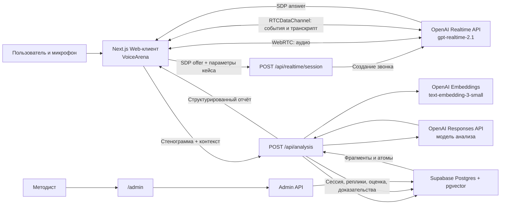
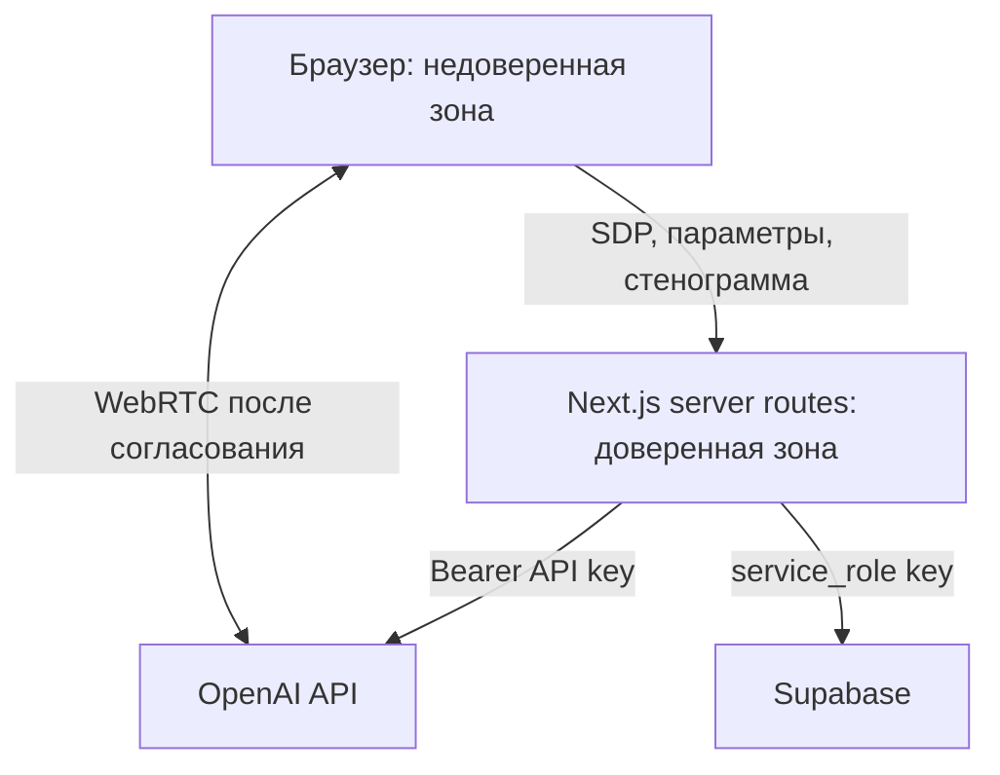

# KORUS NEGA AI 2.0 — голосовой тренажёр переговоров

KORUS NEGA AI 2.0 — русскоязычный тренажёр управленческих переговоров. Пользователь ведёт голосовой диалог с ИИ-оппонентом, получает живую расшифровку, а после завершения — структурированный разбор по методической базе: результат поединка, персональную обратную связь, разбор приёмов, доказательства и план развития.

Репозиторий содержит работающий прототип. В нём реализованы библиотека загружаемых кейсов, AI-конструктор управленческих поединков, два голоса оппонента, голосовой диалог через OpenAI Realtime API, RAG-анализ с выбором методологии Владимира Тарасова, Гарвардского метода или методики Ирины Матвеевой «Работа с конфликтами» и закрытая панель управления методологиями, базой кейсов, пользователями и журналом активности. Все три базы условно верифицированы для рабочего использования и требуют последующей экспертной проверки методологом.

## Возможности

### Переговоры и голосовой контур

- двусторонний голосовой разговор в браузере через WebRTC;
- обязательный русский язык всего голосового поединка: языковой контракт и полный контекст выбранного кейса закрепляются в инструкциях сессии, а локальная режиссура отдельных ходов передаётся системными сообщениями без переопределения сессии; оппонент начинает первым на русском языке с позиции по выбранному кейсу, не использует английское приветствие и не меняет язык вслед за пользователем;
- естественное определение конца реплики (`semantic_vad`) и перебивание оппонента; входной поток дополнительно проходит серверное шумоподавление `far_field`, а сырое срабатывание VAD считается только кандидатом на перебивание и влияет на эмоции, счётчик и речевую аналитику лишь после содержательной расшифровки; пустой сигнал и маркеры фонового шума отбрасываются, после ложного прерывания оппонент автоматически продолжает реплику; если одна пользовательская мысль разделилась на несколько элементов распознавания, клиент дожидается всех уже начатых расшифровок и запускает только один ответ на объединённую реплику;
- защита голосовой сессии от обрыва реплики: клиент отслеживает состояния WebRTC, data channel и удалённого аудиотрека, распознаёт `cancelled`/`incomplete`/`failed` в `response.done`, обнаруживает семисекундную остановку только пока модель ещё генерирует ответ и до двух раз просит оппонента продолжить с места обрыва, если VAD не получил реальной пользовательской реплики; при настоящем перебивании браузер немедленно глушит локальный звук и сам отправляет отмену генерации, очистку уже сгенерированного аудиобуфера и усечение неуслышанной части реплики, поэтому стороны не говорят параллельно даже после завершения генерации ответа;
- ключевые события голосового контура без аудио и текста реплик отправляются в защищённый `/api/realtime/diagnostics` и записываются в production-логи с идентификатором диагностической сессии, пользователя и кейса;
- отдельный живой voice-eval контур в тестовом режиме подаёт синтезированную русскую речь и воспроизводимый фоновый шум через виртуальный микрофон в настоящий WebRTC-сеанс, проверяет обычный диалог, одиночное и повторное перебивание, длинную паузу, ложное срабатывание на шум и неопределённую реплику; отчёт Playwright сохраняет входные аудиофайлы, полную временную шкалу Realtime-событий, технические нарушения и смысловую проверку выдуманных фактов, при этом акустическая оценка слышимости эмоций в текущий контур намеренно не входит;
- два стиля поединка, расположенные рядом в панели настроек: в режиме «Сотрудничество» оппонент ищет взаимовыгодное решение и не перебивает намеренно, а в режиме «Жёсткий» активнее продавливает позицию и получает возможность стратегически перебить собеседника не чаще одного раза на пять собственных реплик;
- динамическая эмоциональная реакция оппонента: между ходами клиент сохраняет доверие, напряжение, раздражение, стремление контролировать разговор и интерес к соглашению, постепенно меняет их по уважению, вопросам, конкретным предложениям, уступкам, извинениям, давлению, обвинениям, уходу от ответа и перебиваниям; после первого подтверждённого перебивания оппонент заметно сдержаннее просит дать ему закончить мысль, после повторного жёстко просит не перебивать и сохраняет накопленное настроение в следующих репликах, а Realtime-модель получает только самую новую режиссуру интонации, темпа, ритма и формулировок; режиссёрские указания выполняются молча и не появляются в прямой речи персонажа отдельными словами вроде «Пауза»; голос `marin`/`cedar` не переключается, аудио и текст реплики не попадают в диагностические события;
- выбор длительности поединка: 3, 5, 10 или 15 минут; оставшееся время показывается на кнопке старта, замораживается на паузе, а по истечении срока тренажёр озвучивает завершение и автоматически запускает анализ; после ручного или автоматического завершения накопленное время полностью сбрасывается и следующий поединок начинается с выбранной исходной длительности;
- два режима микрофона: «Дуплекс» включён по умолчанию и позволяет говорить одновременно с оппонентом и перебивать его; в «Обычном» режиме исходящий аудиотрек включается только во время удержания кнопки микрофона, поэтому шум помещения и комментарии ведущего не обрабатываются; отпускание кнопки не останавливает таймер поединка, таймер замораживается только на общей паузе;
- речевая аналитика для дуплексного режима: после поединка отчёт показывает темп речи, среднюю паузу перед ответом, долю говорения сторон, перебивания, вопросы, долю слов-паразитов в процентах от всех слов пользователя и поведенческий индикатор реакции на давление; речь пользователя измеряется по событиям VAD, а полное окно воспроизведения реплики оппонента — по штатным WebRTC-событиям Realtime API `output_audio_buffer.started/stopped/cleared`; сервер дополнительно проверяет правдоподобие темпа обеих сторон и не публикует зависимые показатели для старых, неполных или противоречивых аудиоданных;
- во время единственной 60-секундной паузы доступна AI-подсказка: модель предлагает общее направление, следующие действия, готовые формулировки и главную ошибку, которой следует избежать; сервер сразу помечает поединок нерейтинговым: он остаётся в истории пользователя, но не влияет на агрегаты и общий рейтинг;
- русская расшифровка реплик пользователя и ИИ в реальном времени;
- измерение задержки от конца реплики пользователя до начала ответа;
- автоматический выбор женского (`marin`) или мужского (`cedar`) голоса: каноническая роль содержит `voiceGender`, поэтому после выбора кейса или роли участника голос назначается по персонажу, которого играет ИИ; ручного переключения голоса в интерфейсе нет;
- стабильный портрет ИИ-оппонента выбирается по имени и полу роли из набора 12 уникальных образов белых русских персонажей (6 женских и 6 мужских), поэтому один персонаж сохраняет внешность между сессиями, а разные кейсы больше не используют одно общее лицо;

### Кейсы, роли и медиаматериалы

- пользовательский раздел `/case-library` показывает доступные публичные и приватные кейсы карточками, сортирует их по общему числу отыгрышей и выводит название, дату, имя автора без почты, счётчик тренировок и первый кадр комикса; полное описание контекста и всех ролей открывается в одном модальном окне, а кнопка запуска передаёт выбранный кейс в тренажёр;
- быстрая загрузка и AI-конструктор доступны из шапки базы кейсов; отдельные кнопки загрузки и создания убраны из левой навигации;
- после утверждения варианта AI-конструктор открывает раздел «Переговоры», выбирает добавленный кейс и показывает сообщение «Спасибо! Кейс добавлен в базу.»;
- канонический кейс поддерживает от двух до четырёх ролей; при выборе роли пользователя одна из остальных ролей случайно назначается ИИ-оппонентом, после чего её голос и полный Realtime-промпт фиксируются до следующей смены роли или кейса;
- после быстрой канонизации или утверждения варианта кейс ставится в постоянную очередь `case_media_jobs`; защищённый GitHub Actions worker запускается каждые пять минут, а ежедневный Vercel Cron служит резервом. Воркер создаёт четыре общих комикс-кадра через `gpt-image-2` с параллельностью 2 и аудиорассказ через Speech API с параллельностью 3, повторяет временные сбои с экспоненциальной задержкой и атомарно публикует только полностью готовую версию пакета;
- `/api/cases/[id]/comic` возвращает статус подготовки и временные подписанные ссылки на персональную версию выбранной роли; интерфейс показывает состояние подготовки, автоматически опрашивает готовность и затем запускает пролог без ожидания генерации;
- подписанные изображения из приватного Supabase Storage выводятся напрямую без проксирования через Next Image Optimizer, чтобы токен ссылки сохранялся полностью и закрытые WEBP стабильно отображались;
- предпросмотр полного содержания выбранного кейса до старта поединка и его серверное озвучивание тем же автоматически назначенным голосом;
- тестовый четырёхкадровый комикс-пролог для кейса «Сорванный срок проекта»: покадровая навигация, подписи поверх изображений и автоматическое последовательное озвучивание сцен голосом `marin` или `cedar`; восемь аудиодорожек подготовлены заранее и предзагружаются при открытии комикса, поэтому переход между сценами не ждёт Speech API; после пролога доступно полное каноническое описание;
- выпадающий список опубликованных кейсов содержит общедоступные кейсы и приватные кейсы текущего участника; приватные пункты помечаются в названии, а публичные API никогда не возвращают скрытые мотивы ни одной роли;
- выбор любой из двух ролей канонического кейса: участник видит цели, интересы и ограничения обеих сторон, а Realtime-модель автоматически получает противоположную роль;
- быстрая загрузка одного файла с автоматическим приведением к каноническому виду и обязательным выбором видимости: общедоступный кейс появляется у всех участников, приватный — только у владельца;
- отдельный раздел `/cases` для накопления описания и нескольких материалов, повторного AI-анализа и выбора одного из двух конфликтных сценариев; пользователь может доверить число ролей описанию или явно потребовать 2, 3 либо 4 полноценные роли, а предпросмотр показывает цель, интересы и ограничения каждой из них; выбранный вариант можно многократно уточнять текстом или голосом — AI возвращает одну исправленную версию с сохранением запрошенного числа ролей, а второй и прежние черновики отбрасываются; после проверки пользователь выбирает видимость и публикует кейс;
- пользовательские черновики и опубликованные кейсы связаны с `user_profiles`; сервер проверяет владельца при продолжении черновика, утверждении варианта, загрузке списка, запуске Realtime-сессии, анализе, подсказке, озвучивании и выдаче подписанных ссылок на комикс;
- поддержка TXT, MD, CSV, JSON, XML, HTML, RTF, PDF и DOCX; текстовые файлы распознаются как UTF-8, UTF-8 с BOM, UTF-16 или Windows-1251, учитываются XML/HTML-декларации и RTF escape-последовательности; оригиналы хранятся в закрытом Supabase Storage, извлечённый текст — в Postgres;
- имена объектов Supabase Storage транслитерируются в безопасный ASCII-ключ, а исходное русское имя нормализуется в Unicode NFC, очищается от управляющих/Bidi-символов, сохраняется отдельно в базе и показывается пользователю;
- генерация сценариев по проверенным методическим атомам: две роли, несовместимые интересы, значимые ставки и отсутствие очевидного решения, полностью устраивающего обе стороны; краткое описание обязано называть участников в соответствии с должностями из канонических ролей;
- новые варианты не повторяют имена персонажей из двенадцати последних кейсов и внутри одной генерации: конструктор исключает недавние полные и первые имена, если конкретный человек не задан в исходных материалах, и всегда блокирует прежние шаблонные имена Ирина Соколова и Алексей Воронцов;
- канонизация требует двух персонифицированных сторон: у каждой обязательно есть реалистичные имя и фамилия в поле `name`, а должность и организационная роль хранятся отдельно в `position`; безымянный вариант нельзя утвердить и опубликовать;
- публичный системный кейс «Релиз под давлением» с Мариной Лебедевой и Тимуром Хабибуллиным предназначен для отработки методики Матвеевой: перехода от взаимных обвинений к общей проблеме, отражения эмоций и прояснения интересов;

### Интерфейс тренажёра

- минимальный явно заданный размер текста на всех страницах составляет 12 px; основной содержательный текст — описания, абзацы, списки, таблицы и поля ввода — отображается размером 13 px, а длинные панели и модальные окна сохраняют прокрутку при увеличении объёма текста;
- единая левая панель с быстрым переходом к переговорам, базе кейсов, личному кабинету, рейтингу, анализу, обратной связи и админ-панели; на десктопе кнопка с неизменённым логотипом KORUS раскрывает текстовые подписи разделов и повторным нажатием возвращает компактный вид, а мобильная горизонтальная навигация остаётся иконной;
- нативные выпадающие меню выбора кейса и роли используют тёмную цветовую схему: пункты отображаются светлым текстом на тёмном фоне, длинное название обрезается по ширине панели, а вся область поля, включая стрелку, раскрывает список; декоративные значки без подсказок в настройках не отображаются;
- стартовый блок с заголовком и кнопкой «Содержание кейса» расположен в верхней части рабочей области и компактно связан с панелью ожидающего аудиоввода; лишние декоративные дата, круг и поясняющая строка в пустом состоянии не отображаются;
- при запуске поединка панель настроек автоматически сворачивается до ширины одной кнопки, рабочая область переговоров и описание кейса получают одинаковую ширину, а карточка оппонента сокращается до портрета, имени и должности; настройки можно временно развернуть и снова свернуть во время активной сессии;
- внизу панели настроек выбирается методология переговоров: методология Владимира Тарасова, Гарвардский метод или «Работа с конфликтами» Ирины Матвеевой; выбор фиксируется в момент запуска анализа, поэтому последующее переключение настроек не меняет методическую основу уже сформированного отчёта;

### Анализ и методология

- отдельный глубокий анализ после завершения разговора;
- отправка на глубокий анализ только после минимум трёх непустых реплик участника; короткая проверка микрофона завершается сообщением о недостатке данных, не вызывает AI-анализ и не сохраняется как результат поединка;
- пост-анализ допускает до 300 секунд обработки, ограничивает каждую попытку модели 120 секундами, один раз повторяет временный или некорректный ответ и безопасно обрабатывает не-JSON ответы платформы; в production-логи без текста переговоров записываются диагностический ID, этап, длительность и тип ошибки;
- методология выбирается независимо как для переговоров внутри тренажёра, так и в разделе `/analyze` для загруженной записи или стенограммы внешнего поединка;
- поиск через embeddings и pgvector ограничивается источником выбранной методологии: правила Тарасова, Гарвардского метода и Матвеевой не смешиваются в одном анализе;
- методическая база включает три условно верифицированные рабочие версии: `tarasov-v1` из 34 атомов, `harvard-v1` из 37 атомов и `conflicts-v1` из 18 атомов; все они доступны для анализа и сохраняют явную пометку о необходимости последующей экспертной проверки;
- оценка результата переговоров по строгой JSON-схеме;
- итоговый балл рассчитывается сервером по фиксированной рубрике из пяти критериев по 20 баллов; модель не может изменить названия, максимум или сумму, а уверенность в результате показывается отдельно;
- проверка цитат: вывод сохраняется только тогда, когда цитата действительно есть в стенограмме и методическом источнике;
- отчёт показывает поворотные моменты, стратагемы, разбор приёмов, подтверждающие цитаты и уверенность; ссылки ведут в доступный участнику режим чтения методической базы, а не в админ-панель;
- серверная сессия создаётся до начала WebRTC-разговора; при завершении стенограмма и реальные метрики задержки атомарно сохраняются до вызова анализа. Повторный анализ использует сохранённые реплики, блокируется атомарным lease и идемпотентно возвращает уже готовый результат;

### Администрирование

#### Управление методологией

- закрытая админ-панель с меню «Методология для валидации»: для выбранной базы отдельно показываются источник, версия, число ожидающих, подтверждённых и отклонённых атомов; над рабочей областью размещён справочник с назначением пяти типов атомов — принципа, правила кейса, тактического приёма, примера и критерия оценки;
- подтверждение, отклонение и редактирование атомов выполняются только внутри выбранного источника и не меняют статусы остальных методологий;
- методика Ирины Матвеевой «Работа с конфликтами» выпущена как условно верифицированная `conflicts-v1` и доступна участникам в селекторах тренажёра и внешнего анализа;
- независимый выпуск условно проверенных версий `tarasov-v1`, `harvard-v1` и `conflicts-v1`;
- воспроизводимый аудит сверяет ожидаемое число атомов, исправляет смысловую классификацию по пяти типам и условно верифицирует все три источника с общей экспертной оговоркой;

#### Управление кейсами

- административный реестр кейсов с датой загрузки, автором или источником генерации, отдельным признаком публичного или приватного доступа, статусом публикации, готовностью четырёхкадрового комикса отдельно для каждой роли и количеством отыгрышей; удаление кейса сохраняет сессии, реплики, оценки и статистику, но очищает все изображения и MP3 его медиапакетов из приватного Storage;
- отдельный полный редактор кейса: основные параметры, статус и источник, две–четыре роли со всеми открытыми и скрытыми полями, ставки, критерии оценки и методическая основа; после сохранения опубликованного кейса медиапакет ставится на безопасную повторную генерацию;

#### Пользователи и логи

- вкладка `/admin/users` показывает ФИО, роль, корпоративную почту, дату регистрации и дату последнего зафиксированного действия; пользователи отсортированы от новых регистраций к старым;
- вкладка `/admin/logs` выводит единый хронологический журнал по 50 событий на странице с постраничной навигацией: регистрация, создание и загрузка кейса, внешний анализ поединка, проведение тренировки и отправка обратной связи;

#### Тестирование платформы

- вкладка `/admin/platform-testing` запускает автономный голосовой диалог по выбранному опубликованному кейсу на 1, 3, 5 или 10 минут: отдельная модель создаёт короткие реплики роли человека, Speech API озвучивает их и подаёт через виртуальный микрофон в защищённую Realtime-сессию; если VAD разделил одну фразу на несколько аудиоэлементов, стенд ждёт окончания воспроизведения и всех начатых расшифровок, объединяет фрагменты в порядке произнесения и только затем разрешает ответ оппонента;
- администратор слышит речь AI-оппонента и видит общую живую стенограмму обеих сторон; тест не требует физического микрофона, не создаёт фиктивную пользовательскую тренировку и может быть досрочно завершён кнопкой;
- после остановки формируется отчёт по ошибкам соединения, отсутствующим и искажённым расшифровкам, задержкам ответа, повторным репликам, выходу из роли, приписанным словам и фактам вне кейса в репликах обеих AI-сторон; акустическая слышимость эмоций намеренно не оценивается на этом этапе;

#### Обратная связь

- отдельный пользовательский раздел `/feedback` позволяет выбрать функциональность из фиксированного списка или указать свой вариант и отправить текст до 5000 символов;
- раздел `/about`, доступный по кнопке с вопросительным знаком между обратной связью и выходом, разделён на три закладки: краткое описание продукта и карточки его создателей, вертикальную карту восьми функциональных направлений и историю всех объединённых PR от новых к старым; обязательное правило проекта требует отражать на этой странице каждое новое исправление или доработку в том же PR;
- сообщение можно надиктовать: браузер временно записывает аудио, сервер расшифровывает его через OpenAI Audio Transcriptions API, а пользователь редактирует полученный текст перед отправкой; исходная аудиозапись не сохраняется;
- вкладка `/admin/feedback` показывает автора, московские дату и время, выбранный раздел, содержание и ручной чекбокс «Отработано»; изменения статуса сохраняются сразу;

#### Защита административного контура

- хранение постоянных API-ключей только на сервере;

### Пользователи, статистика и доступ

#### Учётные записи

- персональная регистрация и вход через Supabase Auth по корпоративной почте и паролю; самостоятельно зарегистрироваться могут только сотрудники с адресами `@korusconsulting.ru` и `@mons.ru`;
- при первом входе автоматически открывается семиэкранный пошаговый онбординг по возможностям платформы, проведению переговоров, прогрессу, собственным кейсам и внешнему анализу; карточки используют фирменный знак и общие иконки разделов без снимков интерфейса. Версия обучения объясняет дуплексную речевую аналитику, влияние AI-подсказки на рейтинг, личную цель и задания, управление сохранёнными данными, видимость кейса и отложенную генерацию изображений и озвучки; новую версию однократно увидят и ранее зарегистрированные участники, после чего обучение доступно для повторного запуска из личного кабинета;
- после успешного входа участник с завершённым онбордингом видит приветственное окно с именем, числом входов, количеством рейтинговых поединков, долей побед, средним баллом и цитатой дня об искусстве переговоров; календарь содержит 31 цитату, привязанную к числу месяца и повторяющуюся ежемесячно; окно закрывается кнопкой, крестиком, клавишей `Escape` или кликом по фону;

#### Личный кабинет и рейтинг

- личный кабинет с датой регистрации, последним поединком, количеством тренировок, долей побед, средним баллом, картой пяти навыков, личной целью, практическими заданиями и полной историей; сохранённый отчёт открывается по клику, сравнивается с предыдущей попыткой того же кейса, а неудачный анализ можно повторить без потери стенограммы;
- общий рейтинг всех участников, включая администраторов, рассчитывается и сортируется SQL/RPC-функцией с серверной пагинацией: количество поединков, побед, доля побед, средний балл по десяти последним оценённым попыткам, до пяти последних уникальных кейсов и дата последнего поединка; название приватного кейса владелец видит полностью, а для других участников SQL возвращает только «Приватный кейс пользователя» без идентификатора и ссылки;

#### Контроль доступа

- подписанная HTTP-only cookie пользовательской сессии закрывает страницы и серверные API от неавторизованных посетителей; все страницы и API под `/admin` доступны только корпоративным адресам из серверного списка администраторов. Отдельного пароля администратора нет, а кнопка админ-панели скрыта у обычных пользователей.

## Текущий статус и ограничения

Это прототип, а не завершённая многопользовательская платформа.

- В базе есть исходный кейс «Сорванный срок проекта» с участниками Ириной Соколовой и Алексеем Воронцовым; новые кейсы можно добавлять быстрой загрузкой или через конструктор.
- Для исходного проверочного кейса используется заранее утверждённый встроенный медиапакет. Для новых загруженных и созданных кейсов медиапакет генерируется автоматически после публикации; до готовности пользователь может открыть полное текстовое содержание.
- Роль пользователя, стиль и длительность переговоров выбираются до старта; отдельная шкала сложности удалена, поскольку поведение оппонента теперь определяется выбранным стилем.
- Роль администратора в `user_profiles` синхронизируется с серверным списком разрешённых корпоративных адресов. Сейчас администратором является Максим Сумин (`msumin@korusconsulting.ru`); самостоятельная выдача прав через интерфейс не поддерживается.
- Черновики конструктора и опубликованные пользовательские кейсы принадлежат автору; сервер проверяет владельца на каждом чтении и изменении. Квоты на число материалов пока не реализованы.
- Поединки, созданные до персональной авторизации, остаются без владельца и не входят в личную статистику или рейтинг.
- В одном черновике принимается до 6 файлов суммарным размером до 4 МБ; один файл — до 3 МБ. Лимит учитывает и материалы, сохранённые в предыдущих запусках анализа. Заведомо большой multipart-запрос прерывается до разбора файлов, а DOCX проверяется по структуре архива и допустимому размеру после распаковки. Старый бинарный формат `.doc` не поддерживается, используйте `.docx`. Описание кейса можно надиктовать кнопкой микрофона прямо в поле: браузер записывает аудио, сервер расшифровывает его на русском языке и добавляет текст к уже введённому описанию; исходная аудиозапись не сохраняется.
- Повторные быстрые нажатия не создают параллельные голосовые подключения, подсказки, анализы или загрузки. Подключение к голосовому каналу завершается понятной ошибкой по тайм-ауту, а новая тренировка недоступна, пока не закончен разбор предыдущей.
- Аудио не сохраняется; для дуплексных переговоров сохраняются текстовые реплики, итоговые агрегаты речевой аналитики, ограниченный массив временных интервалов речи и пауз для аудита достоверности и результаты анализа, но не исходная аудиозапись.
- Админ-доступ персональный: права определяются по серверному списку корпоративных учётных записей.
- Поле автора кейса хранит имя, фамилию и корпоративную почту участника для новых загрузок и генераций; для исторических записей миграция проставляет обобщённый источник, поскольку прежняя схема не сохраняла автора.
- Все операции Supabase выполняются серверным клиентом с `service_role`; публичного клиентского доступа к базе нет.
- Оригинал книги не входит в Git-репозиторий. Он хранится локально и в приватном Supabase Storage.
- все три методические базы условно подтверждены для работы прототипа: 34 атома `tarasov-v1`, 37 атомов `harvard-v1` и 18 атомов `conflicts-v1`; перед коммерческим использованием необходима полноценная экспертная перепроверка.

Проектное видение следующих этапов находится в [docs/ARCHITECTURE.md](docs/ARCHITECTURE.md), а сведения об источнике — в [docs/SOURCE_MANIFEST.md](docs/SOURCE_MANIFEST.md). Этот README описывает прежде всего фактически реализованную систему.

## Архитектура

### Telegram-мониторинг активности

После регистрации нового участника, завершения тренировки, быстрой загрузки кейса, публикации кейса из AI-конструктора или отправки обратной связи сервер сохраняет уникальное событие в `user_activity_events` и отправляет сообщение в личный Telegram-чат ответственного. Уведомление о регистрации содержит имя, фамилию и корпоративную почту нового пользователя. Уведомление об обратной связи содержит имя автора, выбранный раздел и прямую ссылку на `/admin/feedback`. Ошибка Telegram не отменяет пользовательское действие, а событие остаётся в базе с пустым `telegram_sent_at` для диагностики.

Vercel Cron вызывает защищённый маршрут `GET /api/cron/weekly-activity` каждый понедельник в 06:00 UTC (09:00 по Москве). Маршрут считает за предыдущие московские понедельник–воскресенье уникальных активных пользователей, новые регистрации, завершённые тренировки и созданные кейсы, включая быстрые загрузки. Число новых пользователей определяется непосредственно по датам создания профилей в `user_profiles`, поэтому не зависит от наличия оперативных событий `user_registered`. В ту же сводку добавляется дайджест доработок из истории `/about` за отчётную неделю со ссылками на соответствующие PR, после чего сообщение один раз отправляется в групповой чат. Сообщение передаётся как UTF-8 JSON и использует HTML-разметку Telegram для жирных заголовков и ссылок. Дополнительный маршрут `GET /api/cron/weekly-activity-fallback` проверяет доставку ежедневно в 09:00 UTC (12:00 по Москве): если основной запуск был пропущен, он отправляет тот же отчёт, а в остальные дни завершается без сообщения. Оба маршрута используют одну запись периода в `user_activity_weekly_reports`, поэтому повторная отправка исключена.

### Общая схема


```mermaid
flowchart LR
    U["Пользователь и микрофон"] --> UI["Next.js Web-клиент<br/>VoiceArena"]
    UI -->|"SDP offer + параметры кейса"| RTAPI["POST /api/realtime/session"]
    RTAPI -->|"Создание звонка"| OAIR["OpenAI Realtime API<br/>gpt-realtime-2.1"]
    OAIR -->|"SDP answer"| UI
    UI <-->|"WebRTC: аудио"| OAIR
    UI <-->|"RTCDataChannel: события и транскрипт"| OAIR

    UI -->|"Стенограмма + контекст"| ANALYSIS["POST /api/analysis"]
    ANALYSIS --> EMB["OpenAI Embeddings<br/>text-embedding-3-small"]
    ANALYSIS --> DB["Supabase Postgres + pgvector"]
    DB -->|"Фрагменты и атомы"| ANALYSIS
    ANALYSIS --> RESP["OpenAI Responses API<br/>модель анализа"]
    RESP --> ANALYSIS
    ANALYSIS -->|"Сессия, реплики, оценка, доказательства"| DB
    ANALYSIS -->|"Структурированный отчёт"| UI

    A["Методист"] --> ADMIN["/admin"]
    ADMIN --> ADMINAPI["Admin API"]
    ADMINAPI --> DB
```

Архитектура разделяет быстрый голосовой контур и более медленный аналитический контур. Во время разговора модель не выполняет поиск по книге и не строит большой отчёт — это уменьшает задержку. RAG и reasoning запускаются только после завершения сессии.

### Авторизация и пользовательская статистика

`/register` создаёт подтверждённую учётную запись Supabase Auth и связанную запись `user_profiles`. Сервер повторно проверяет имя, фамилию, длину пароля и точное совпадение домена корпоративной почты, а после успеха направляет участника на главную страницу с первым запуском онбординга. Версионированный признак прохождения хранится локально в браузере: отсутствие признака текущей версии автоматически запускает обучение в авторизованной части сервиса, поэтому обновлённый онбординг однократно показывается и существующим пользователям. Незавершённое обучение снова откроется после перезагрузки, а кнопка в `/account` позволяет запустить его в любой момент. `/login` проверяет пару почта/пароль через Supabase Auth, после чего приложение выдаёт подписанную HMAC-SHA256 HTTP-only cookie на семь дней и сохраняет событие успешного входа `user_logged_in`. После редиректа общий клиентский компонент показывает завершившему онбординг участнику приветственное окно с актуальной персональной статистикой и одной из 31 переговорных цитат, выбранной по числу месяца. Пароль и access token Supabase в cookie не сохраняются.

`POST /api/sessions` создаёт принадлежащую участнику запись до запуска WebRTC и фиксирует кейс, роли, методологию, текущую учебную цель и дату автоматического удаления. Endpoint требует явного согласия на сохранение стенограммы. `PATCH /api/sessions/[id]` нормализует до 500 реплик, серверно рассчитывает p50/p95 и атомарным RPC сохраняет стенограмму и метрики до анализа. После успешной AI-подсказки `/api/hint` сразу ставит `is_ranked = false`, поэтому клиент не может вернуть результат в рейтинг. `/account` показывает всю сохранённую историю, но агрегаты и `/rating` используют только рейтинговые сессии со статусом `analyzed`. Победой считается только `outcome.winner = "user"`; средний балл считается SQL по десяти последним оценённым рейтинговым сессиям.

### 1. Клиентский слой

Основной интерфейс подключён через `src/components/VoiceArena.tsx` на главной странице `src/app/page.tsx`. Жизненный цикл задаёт reducer `idle → connecting → live → paused → ending → analyzing → complete`; таймер, стенограмма, narration, comic и report вынесены в отдельные hooks, а низкоуровневые операции WebRTC — в отдельный модуль. Semantic VAD фиксирует начало и окончание речи, но не запускает ответ автоматически: клиент проверяет расшифровку, накапливает незавершённые фрагменты вроде «Я» и вручную разрешает ответ только после содержательной реплики. Идентификаторы уже начатых аудиоэлементов удерживают шлюз ответа, пока не завершатся все их расшифровки; если поздний фрагмент всё же приходит после старта ответа, преждевременный ответ отменяется и заменяется одним ответом на полную мысль. Короткие законченные ответы («Да», «Нет», «Согласен») проходят сразу, а после тайм-аута незавершённой мысли оппонент может только нейтрально попросить продолжить. При снятии паузы автоматически возобновляется лишь реплика оппонента, которая действительно была слышна до паузы.
Единая компактная панель навигации для тренажёра, пользовательской базы кейсов, кабинета, рейтинга, анализа внешних поединков, обратной связи, раздела «О программе» и админ-раздела реализована в `src/components/AppNavRail.tsx`. На экранах шире 820 px логотип KORUS служит кнопкой раскрытия панели: рядом с иконками появляются текстовые подписи, выбранная ширина сохраняется в браузере, а направленный шеврон подсказывает действие. На мобильной горизонтальной панели раскрытие и индикатор скрыты. Кнопка «База кейсов» открывает `/case-library`; загрузка и создание кейсов запускаются из шапки этого раздела. После входа приветственное окно дополнительно предлагает быстрые переходы «Тренировать», «База кейсов» и «Личный кабинет».
Общий клиентский компонент `src/components/OnboardingModal.tsx` подключён в корневом layout и показывает семь карточных экранов: назначение платформы, карту возможностей, переговоры, прогресс, собственные кейсы, внешний анализ и переход к первой тренировке. Онбординг не содержит снимков интерфейса: логотип и иконки разделов используются через те же общие компоненты, что и в продуктовой навигации. Обзор отдельно сообщает о работе без VPN, адаптации для телефона и отсутствии дополнительной установки. Версия `korus-nega-onboarding-v4` отражает актуальные дуплексный режим, учебный цикл, приватность данных и публикацию кейсов; она один раз открывается автоматически, а кнопка в личном кабинете позволяет запустить её повторно. Модальное окно поддерживает «Пропустить», «Назад», «Далее», клавиши `Escape` и ←/→, удерживает фокус внутри и перестраивается в одноколоночную мобильную карточку. Все шаги сохраняют одинаковый внешний размер: на десктопе визуальная колонка непрерывно занимает левую часть карточки, а при нехватке места прокручивается только текстовая область без смещения прогресса и кнопок.

`VoiceArena` координирует:

- запрос доступа к микрофону через `navigator.mediaDevices.getUserMedia`;
- создание `RTCPeerConnection`;
- отправку микрофонного аудиотрека в Realtime API;
- воспроизведение удалённого аудиотрека модели;
- обработку событий через канал `oai-events`;
- сбор пользовательских и модельных транскриптов;
- отображение состояний «готов», «подключение», «в эфире» и ошибок;
- компактную область диалога с внутренней прокруткой реплик и постоянным расположением кнопок «НАЧАТЬ», «ПАУЗА» и «ЗАВЕРШИТЬ» сразу под диалогом, до итогового отчёта;
- динамический режим активного поединка со сворачиваемой панелью настроек, равными рабочими колонками, компактной карточкой оппонента и прокручиваемым описанием кейса в оставшейся высоте экрана;
- изменение мышью ширины панелей настроек, переговоров и описания кейса на десктопе: разделители сохраняют выбранные размеры в браузере, поддерживают клавиши ←/→ и не дают рабочим областям стать уже безопасного минимума;
- одну 60-секундную паузу за поединок: на паузе микрофон, серверное определение хода, генерация и воспроизведение оппонента остановлены, таймер поединка заморожен, а обратный отсчёт можно завершить досрочно нажатием; если пауза прервала реплику оппонента, после возобновления она продолжается с услышанного места и остаётся одной репликой в стенограмме;
- запрос структурированной подсказки через `POST /api/hint` только во время паузы и отображение тактического направления, действий, формулировок и риска; успешная подсказка помечает итог поединка как нерейтинговый;
- переходы state machine и композицию независимых контроллеров WebRTC, таймера, стенограммы, narration, comic и post-report;
- сбор только в дуплексном режиме длительности речи сторон, пауз до ответа и подтверждённых содержательной расшифровкой событий перебивания без записи аудио; начало и полное опустошение выходного аудиобуфера оппонента определяются штатными WebRTC-событиями Realtime API, поэтому внутрисловная громкость и естественные микропаузы не завершают реплику преждевременно, а посторонний шум не завышает число перебиваний;
- обновление эмоционального состояния только после содержательной завершённой реплики: накопленные и параллельно распознаваемые фрагменты объединяются в один ход, перебивание учитывается отдельным сигналом только после подтверждения речи, изменение каждой шкалы ограничено за один ход, а режиссура следующей реплики отправляется без дополнительного модельного запроса и требует только прямую речь персонажа без озвучивания сценических ремарок;
- обратный отсчёт выбранных 3, 5, 10 или 15 минут на кнопке старта, голосовое уведомление по истечении времени и автоматическое завершение с последующим анализом;
- нормализацию и сохранение до 500 реплик стенограммы с ограничением 2000 символов на реплику и её отправку на `/api/analysis`;
- отображение структурированного отчёта.

Клиент не получает `OPENAI_API_KEY`, `SUPABASE_SERVICE_ROLE_KEY` и скрытые мотивы персонажей. Идентификаторы ролей передаются серверу, но канонический контекст, цели, ограничения и закрытые параметры сервер повторно загружает из опубликованного кейса.

### 2. Голосовой контур Realtime

Маршрут `src/app/api/realtime/session/route.ts` работает как небольшой BFF между браузером и OpenAI.

Последовательность открытия сессии:

1. Клиент создаёт локальный WebRTC offer.
2. Клиент отправляет SDP на `POST /api/realtime/session` вместе с идентификатором кейса, индексами выбранных ролей, стилем переговоров и автоматически назначенным голосом ИИ-персонажа.
3. Сервер загружает опубликованный кейс, проверяет SDP и индексы ролей и формирует инструкции через `src/lib/prompt.ts`; переданные клиентом описания роли и контекста не считаются источником истины. Фактическая точность имеет приоритет над ролевой правдоподобностью: оппоненту запрещено заполнять пробелы выдуманными причинами, ресурсами, процессами, числами или договорённостями, а неизвестную конкретику он должен уточнить либо предложить проверить.
4. Сервер создаёт Realtime call запросом к `https://api.openai.com/v1/realtime/calls`, используя секретный API-ключ.
5. OpenAI возвращает SDP answer, который сервер пересылает браузеру.
6. После установления соединения аудио идёт напрямую между браузером и OpenAI по WebRTC.
7. Транскрипты, состояния речи и служебные события передаются через `RTCDataChannel`.
8. Перед отдельным ходом клиент при необходимости добавляет локальную режиссуру системным сообщением, затем отправляет `response.create` без поля `instructions`, чтобы ответ продолжал использовать серверный контекст выбранного кейса.

Параметры голосовой модели:

| Параметр | Значение |
|---|---|
| Модель | `gpt-realtime-2.1` |
| Формат ответа | аудио |
| Reasoning | `low` |
| Транскрибация | `gpt-live-transcribe`, подсказка языка `ru`, минимальная задержка |
| Определение реплики | `semantic_vad` |
| Чувствительность VAD | `low` для сотрудничества; управляемое переключение `low`/`high` для жёсткого режима |
| Автоматический ответ | отключён; после проверки законченности реплики клиент вручную отправляет `response.create` |
| Язык и контекст | строго русский для первой и всех последующих реплик; языковой контракт, роль и выбранный кейс закреплены в сессии, а `response.create` не переопределяет эти инструкции |
| Перебивание ответа | включено |
| Голоса | `marin`, `cedar` |

`GET /api/realtime/session` выполняет простую проверку наличия `OPENAI_API_KEY` и возвращает `503`, если ключ не настроен.

### 3. Аналитический контур

После нажатия «Завершить» клиент отправляет на `POST /api/analysis`:

- идентификатор/код кейса и индексы выбранных ролей;
- автоматически назначенный голос оппонента;
- время начала и длительность;
- нормализованную стенограмму до 500 реплик и 2000 символов на реплику.

Маршрут анализа выполняет следующие этапы:

1. Загружает опубликованный кейс и канонические роли из Supabase; для встроенного кейса использует серверную константу.
2. Проверяет, что есть минимум две содержательные реплики и хотя бы одна реплика пользователя.
3. Строит embedding контекста и стенограммы моделью `text-embedding-3-small`.
4. Вызывает Supabase RPC `match_method_chunks` и получает до восьми фрагментов с cosine similarity не ниже `0.3`.
5. Загружает связанные методические атомы и статус версии методологии.
6. Передаёт кейс, стенограмму, атомы и найденные фрагменты в OpenAI Responses API.
7. Требует ответ по строгой JSON Schema из `src/lib/analysis-types.ts`.
8. Повторно валидирует доказательства на сервере: цитаты должны дословно присутствовать в доступном корпусе и стенограмме, а идентификаторы атомов — существовать.
9. Сохраняет сессию, реплики, оценку и прошедшие проверку доказательства в Supabase; при ошибке компенсирующе удаляет всю незавершённую запись сессии.
10. Возвращает клиенту готовый отчёт.

Модель анализа задаётся через `OPENAI_ANALYSIS_MODEL`; значение по умолчанию — `gpt-5.4-mini`, reasoning effort — `medium`.

Итоговая структура `NegotiationAnalysis` содержит:

- общий балл от 0 до 100;
- победителя: пользователь, оппонент или ничья;
- краткий вердикт и причины;
- персональную обратную связь;
- детализацию баллов по критериям;
- сильные стороны и риски;
- поворотные моменты;
- обнаруженные, возможные и упущенные приёмы;
- альтернативные формулировки;
- план развития;
- цитаты-доказательства и уровень уверенности;
- версию и статус методологии.

### 4. Анализ поединка, проведённого вне платформы

Раздел `/analyze` принимает текст самого кейса и запись уже проведённого переговорного поединка. Кейс можно загрузить поддерживаемым текстовым файлом либо вставить его текст прямо в большое поле формы; вставленный текст передаётся в существующий контур анализа как обычный TXT-файл и отдельно не сохраняется. Запись можно передать готовой текстовой расшифровкой либо аудиофайлом FLAC, MP3, MPEG, MPGA, M4A, OGG, WAV или WebM размером до 25 МБ; видео на этом этапе не поддерживается. Ограничение явно показано до выбора файла и повторно проверяется на сервере. Для корректного сопоставления реплик пользователь указывает имена или обозначения двух участников.

Аудио загружается из браузера напрямую во временный приватный bucket `duel-recordings` по короткоживущему подписанному URL, поэтому файл не проходит через 4,5-МБ тело запроса Vercel Function. `POST /api/duel-transcription/upload` выпускает URL только для авторизованного пользователя, а `POST /api/duel-transcription` скачивает его на сервере, проверяет владельца и размер, вызывает `gpt-4o-transcribe-diarize` с автоматическим VAD-разбиением и удаляет исходную запись в `finally`. Распознавание получает общий бюджет до 292 секунд внутри 300-секундного предела Vercel Function. Если соединение оборвалось быстро, сервер повторяет запрос с оставшимся временем; после долгого таймаута бесполезный повтор не запускается. Окончательная ошибка содержит диагностический код. Ежедневный cron также удаляет записи старше суток, оставшиеся после закрытого браузера или оборванного запроса. После расшифровки пользователь сопоставляет два обнаруженных голоса с именами участников и только затем запускает существующий анализ.

`POST /api/duel-analysis` извлекает текст из кейса и готовой либо автоматически созданной расшифровки, восстанавливает роли, цели, интересы, ограничения и центральный конфликт, а затем строит общий embedding репрезентативных фрагментов кейса и расшифровки. Вспомогательный поисковый запрос ограничен безопасным размером в UTF-8 и при сокращении сохраняет начало и конец обоих материалов, поэтому длинные русскоязычные записи не превышают контекстный лимит embedding-модели. После поиска релевантных фрагментов методической базы модель получает полный текст материалов и оценивает фактический разговор относительно условий загруженного кейса. Загруженные внешние материалы не записываются в таблицы тренировочных сессий и не влияют на рейтинг пользователя.

Строгая схема `DuelFileAnalysis` из `src/lib/duel-file-analysis-types.ts` требует:

- победителя, вердикт, причины и уверенность вывода;
- поворотные моменты разговора;
- отдельный балл и резюме для каждого участника;
- отдельные сильные стороны и зоны улучшения;
- отдельный разбор приёмов с дословными цитатами из расшифровки и методологии;
- отдельный практический план развития для каждого участника.

Сервер отбрасывает элементы разбора, если цитата не найдена дословно в соответствующем загруженном или методическом тексте. Если спикеров или исход нельзя определить надёжно, анализатор возвращает ничью с пониженной уверенностью, сохраняя раздельную обратную связь обоим участникам.

### 4. Методическая база и RAG

FB2/XML и текстовые источники (включая TXT в Windows-1251) обрабатывает `scripts/ingest-methodology.mjs`. Код, автор, название и slug версии источника задаются переменными `METHODOLOGY_CODE`, `METHODOLOGY_AUTHOR`, `METHODOLOGY_TITLE` и `METHODOLOGY_SLUG`; без них сохраняется конфигурация Тарасова.

Для воспроизводимого дополнения центральных правил «Работы с конфликтами» используется `scripts/seed-conflicts-core-atoms.mjs`. Скрипт находит каждый исходный фрагмент по дословной цитате и создаёт атомы-кандидаты, а `scripts/audit-and-conditionally-verify-methodologies.mjs` проверяет и выпускает согласованную рабочую классификацию всех трёх баз.

Конвейер импорта:

1. Читает источник по пути `METHODOLOGY_SOURCE_PATH`.
2. Вычисляет SHA-256 для контроля версии файла.
3. Читает кодировку из BOM или XML-декларации (UTF-8, UTF-16, Windows-1251), затем извлекает заголовки и абзацы из FB2/XML.
4. Формирует смысловые фрагменты размером примерно до 3200 символов.
5. Загружает оригинал в приватный bucket `methodology-sources`.
6. Создаёт embeddings и записывает фрагменты в `document_chunks`.
7. При запуске с `--extract-atoms` выбирает релевантные фрагменты и извлекает кандидаты в атомарные правила выбранного автора через Responses API.
8. Сохраняет только те атомы, чья `sourceQuote` дословно найдена в исходном фрагменте.

Обычный импорт идемпотентен: источник сопоставляется по SHA-256, а фрагменты — по паре `source_id + chunk_index`.

Методический атом имеет один из пяти типов: `principle` («Принцип»), `case_rule` («Правило кейса»), `stratagem` («Тактический приём»), `example` («Пример») или `evaluation_criterion` («Критерий оценки»). `case_rule` используется только для конкретных условий учебного упражнения, а не для общих закономерностей или пошаговых приёмов; каждый атом также хранит формулировку, сигналы, контрпримеры, исходную цитату, версию и статус проверки.

### 5. Админ-панель

Админ-панель доступна по адресу `/admin` только пользователям из серверного списка администраторов. Текущий администратор — Максим Сумин (`msumin@korusconsulting.ru`). После обычного входа на платформу дополнительный пароль не требуется; у остальных пользователей кнопка скрыта, прямые адреса страниц перенаправляют в тренажёр, а закрытые API возвращают отказ в доступе.

- защищённый layout повторно проверяет роль текущей пользовательской сессии;
- `/admin/methodology` — выбор методологии, просмотр и проверка её атомов;
- `/admin/users` — список пользователей по дате регистрации с ролью, почтой и последней активностью;
- `/admin/logs` — журнал ключевых пользовательских действий с пагинацией по 50 событий;
- `/admin/cases` — реестр загруженных и сгенерированных кейсов с признаком публичного или приватного доступа, статусами комикса по ролям и счётчиками отыгрышей;
- `/admin/cases/[id]` — отдельная форма полного редактирования кейса;
- `/admin/feedback` — реестр пользовательской обратной связи с ручной отметкой обработки;
- `/admin/platform-testing` — управляемый AI-to-AI голосовой тест выбранного кейса с прослушиванием оппонента, стенограммой и итоговым отчётом об аномалиях;
- `/admin/infrastructure` — дашборд критических лимитов Vercel и Supabase с текущим потреблением, процентом исчерпания и порогами предупреждения 70/90%; размеры Postgres, Storage и число Auth-аккаунтов читаются в реальном времени через закрытую RPC-функцию, а недоступные провайдеру показатели явно помечаются как отсутствующие;
- `PATCH /api/admin/methodology/[id]` — редактирование и смена статуса атома;
- `POST /api/admin/methodology/release` — выпуск `v1` выбранной методологии.
- `PUT /api/admin/cases/[id]` — проверка и сохранение всех параметров кейса с постановкой медиапакета на обновление;
- `DELETE /api/admin/cases/[id]` — удаление кейса; связанные медиаматериалы удаляются каскадно, а исторические тренировки сохраняются без ссылки на удалённую запись.
- `PATCH /api/admin/feedback/[id]` — ручное изменение статуса обработки обращения.

Единый пользовательский токен подписан HMAC-SHA256, хранится в `HttpOnly`, `SameSite=Strict` cookie и действует семь дней. В production cookie также получает флаг `Secure`. Административное право определяется только на сервере по подписанной корпоративной почте и повторно проверяется в закрытых обработчиках. Для выпуска `v1` выбранной методологии не должно остаться атомов со статусом `candidate`, а подтверждённых атомов должно быть не меньше десяти. Изменение атома после выпуска возвращает только связанный источник в предварительный статус до следующего релиза.

### 6. Хранилище данных

Миграции в `supabase/migrations/` создают расширение pgvector, приватные Storage bucket, RPC векторного поиска и атомарного утверждения кейса, а также версионированные задания медиаконвейера.

| Таблица | Назначение |
|---|---|
| `method_sources` | Источник методологии, хеш, путь в Storage, версия и статус проверки |
| `document_chunks` | Фрагменты книги, иерархия разделов и embeddings размерности 1536 |
| `method_atoms` | Атомарные правила, цитаты и решения методиста |
| `user_profiles` | Имя, фамилия, корпоративная почта, роль и дата регистрации участника |
| `user_feedback` | Автор, раздел, текст обращения, дата и ручной статус обработки; аудио не хранится |
| `training_sessions` | Метаданные тренировок, выбранная роль, признак рейтинговой сессии, ссылка на участника и дата автоматического удаления |
| `session_metrics` | Реальные задержки установки и ответа p50/p95, восстановления, перебивания и ошибки соединения; в `details.speechAnalytics` — проверенные серверные агрегаты речевой аналитики, в `details.speechTiming` — ограниченные исходные интервалы версии 3 для аудита расчёта |
| `user_learning_goals` | Личный навык, цель и наблюдаемое поведение для следующей тренировки |
| `practice_tasks` | Практические задания из пост-разбора и статус их выполнения |
| `case_workspaces` | Пользовательские черновики конструктора, их владелец, статус и даты |
| `negotiation_cases` | Канонические параметры кейсов, роли, источник, автор, владелец, видимость, публикационный статус и даты |
| `case_media_jobs` | Состояние и версия фоновой подготовки медиапакета кейса |
| `case_comic_panels` | Четыре панели и аудиодорожки для каждой роли опубликованной версии комикса |
| `turns` | Последовательность реплик пользователя и оппонента |
| `evaluations` | Полный JSON результата и сводные поля оценки |
| `evaluation_evidence` | Связь вывода с репликой, цитатой источника и уверенностью |

Для векторного поиска используется HNSW-индекс и cosine distance. На таблицах включён RLS, но права выдаются только `service_role`; серверный ключ никогда не должен попадать в клиентский код.

### 7. Границы доверия и безопасность


```mermaid
flowchart TB
    B["Браузер: недоверенная зона"]
    N["Next.js server routes: доверенная зона"]
    O["OpenAI API"]
    S["Supabase"]

    B -->|"SDP, параметры, стенограмма"| N
    N -->|"Bearer API key"| O
    N -->|"service_role key"| S
    B <-->|"WebRTC после согласования"| O
```

Основные меры:

- секреты читаются только серверными модулями с `server-only`;
- SDP и пользовательские строки ограничиваются и проверяются;
- голосовой промпт требует сохранять роль и не раскрывать инструкции;
- аналитическая модель получает только извлечённые фрагменты, а не полагается на память о книге;
- JSON Schema ограничивает форму результата;
- цитаты дополнительно проверяются программно до сохранения;
- админские изменяющие запросы требуют подписанную сессию и проверяют origin;
- диагностический API Realtime принимает только ограниченный список событий и короткие скалярные поля, не журналирует аудио, стенограмму и скрытые параметры кейса;
- оригинал книги хранится в приватном bucket и не коммитится в Git.

Текущие ограничения безопасности: отсутствуют rate limiting, пользовательское самостоятельное восстановление пароля, квоты на число материалов и аудит действий администратора. Проверка владельца черновиков и приватных кейсов реализована на сервере; названия приватных кейсов обезличиваются в рейтинге на уровне SQL.

## Структура проекта

```text
src/
├── app/
│   ├── page.tsx                         # главная страница тренажёра
│   ├── globals.css                      # стили интерфейса
│   ├── api/
│   │   ├── realtime/session/route.ts    # создание WebRTC Realtime-сессии
│   │   ├── hint/route.ts                # тактическая AI-подсказка во время паузы
│   │   ├── analysis/route.ts            # RAG, анализ и сохранение результата
│   │   └── admin/                       # защищённые API методологии, кейсов и тестирования платформы
│   └── admin/                           # обзор, методология, кейсы и управляемые AI-to-AI тесты
├── components/
│   ├── AppNavRail.tsx                   # единая иконная панель навигации
│   ├── VoiceArena.tsx                   # координатор голосового интерфейса
│   ├── PrivacyControls.tsx              # согласие, хранение, экспорт и удаление данных
│   ├── MethodologyReview.tsx            # интерфейс методиста
│   ├── AdminCaseList.tsx                # административный реестр кейсов
│   ├── PlatformTestingPanel.tsx         # запуск голосового AI-to-AI теста и отчёт
│   └── AdminCaseEditor.tsx              # полный редактор канонического кейса
├── hooks/                               # timer, transcript, narration, comic и report
└── lib/
    ├── prompt.ts                        # инструкции голосового оппонента
    ├── hint-types.ts                    # тип и JSON Schema подсказки
    ├── analysis-types.ts                # типы и JSON Schema анализа
    ├── openai-server.ts                 # серверный клиент OpenAI
    ├── supabase-server.ts               # серверный клиент Supabase
    ├── admin-access.ts                  # список корпоративных учётных записей администраторов
    ├── platform-test.ts                 # типы и технические критерии теста платформы
    └── admin-auth.ts                    # серверная проверка роли текущего пользователя
scripts/
└── ingest-methodology.mjs               # импорт FB2, embeddings и атомы
supabase/migrations/
└── 20260710220000_methodology_core.sql  # схема БД, pgvector и Storage
docs/
├── ARCHITECTURE.md                      # проектное развитие архитектуры
└── SOURCE_MANIFEST.md                   # паспорт методического источника
public/opponents/                        # изображения оппонентов
```

## Локальный запуск

### Требования

- Node.js 20 или новее;
- npm;
- проект Supabase с поддержкой pgvector;
- OpenAI API key с доступом к используемым моделям;
- FB2-файл методического источника для заполнения RAG-базы.

### Установка

1. Установите зависимости:

   ```bash
   npm install
   ```

2. Скопируйте `.env.example` в `.env.local` и заполните переменные.

3. Примените SQL-миграцию из `supabase/migrations/` к проекту Supabase.

4. Поместите FB2-файл в приватную локальную папку и укажите его путь в `METHODOLOGY_SOURCE_PATH`.

5. Импортируйте источник и embeddings:

   ```bash
   npm run methodology:ingest
   ```

6. При необходимости извлеките кандидаты в методические атомы:

   ```bash
   npm run methodology:extract
   ```

7. Запустите приложение:

   ```bash
   npm run dev
   ```

8. Откройте `http://localhost:3000` и разрешите браузеру доступ к микрофону.

Для проверки атомов откройте `http://localhost:3000/admin`.

## Переменные окружения

| Переменная | Обязательность | Назначение |
|---|---|---|
| `OPENAI_API_KEY` | обязательно | Realtime, embeddings, анализ и расшифровка аудио внешнего поединка |
| `SUPABASE_URL` | обязательно | URL проекта Supabase |
| `SUPABASE_SERVICE_ROLE_KEY` | обязательно | серверный доступ к БД и Storage |
| `OPENAI_ANALYSIS_MODEL` | необязательно | модель пост-анализа; по умолчанию `gpt-5.4-mini` |
| `OPENAI_IMAGE_MODEL` | необязательно | модель фоновой генерации изображений кейса; по умолчанию `gpt-image-2` |
| `OPENAI_TTS_MODEL` | необязательно | модель фоновой озвучки кейса; по умолчанию `gpt-4o-mini-tts` |
| `OPENAI_TRANSCRIPTION_MODEL` | необязательно | модель расшифровки голосовой обратной связи; по умолчанию `gpt-4o-mini-transcribe` |
| `VOICE_EVAL_TTS_MODEL` | необязательно | отдельная TTS-модель виртуального участника voice-eval; по умолчанию используется `OPENAI_TTS_MODEL` |
| `VOICE_EVAL_USER_VOICE` | необязательно | голос виртуального участника voice-eval; по умолчанию `marin` |
| `VOICE_EVAL_JUDGE_MODEL` | необязательно | модель смысловой проверки выдуманных фактов и реплик; по умолчанию используется `OPENAI_ANALYSIS_MODEL` |
| `VOICE_EVAL_PARTICIPANT_MODEL` | необязательно | модель, создающая реплики роли человека в админском тестировании платформы; по умолчанию используется `OPENAI_ANALYSIS_MODEL` |
| `METHODOLOGY_SOURCE_PATH` | для импорта | локальный путь к FB2-файлу |
| `SITE_SESSION_SECRET` | обязательно для пользовательских сессий | секрет подписи единой HTTP-only cookie, минимум 32 символа |
| `CRON_SECRET` | обязательно в production | Bearer-секрет Vercel Cron для обработки `case_media_jobs` |
| `TELEGRAM_BOT_TOKEN` | обязательно для мониторинга | Секретный токен Telegram-бота; используется только сервером |
| `TELEGRAM_MONITOR_USER_CHAT_ID` | обязательно для мониторинга | Chat ID получателя оперативных уведомлений |
| `TELEGRAM_WEEKLY_CHAT_ID` | обязательно для мониторинга | Chat ID группового чата с недельной сводкой |
| `VERCEL_ACCESS_TOKEN` | необязательно | токен Vercel Billing API для дашборда лимитов; API доступен на Pro/Enterprise |
| `VERCEL_TEAM_ID` | необязательно | идентификатор команды Vercel, для которой запрашивается Usage |

Не добавляйте `.env.local`, ключи и исходную книгу в Git.

## Команды

| Команда | Назначение |
|---|---|
| `npm run dev` | запуск Next.js в режиме разработки |
| `npm run dev:voice-evals` | закрытый локальный сервер voice-eval на порту 3101; маршрут недоступен без `E2E_TEST_MODE=1` |
| `npm run build` | production-сборка |
| `npm run start` | запуск собранного приложения |
| `npm run lint` | ESLint для `src`/`tests` и проверка синтаксиса скрипта импорта |
| `npm run typecheck` | строгая проверка TypeScript без генерации файлов |
| `npm test` | модульные тесты кодировок, Unicode, публичной модели кейса, промптов, стенограммы, фиксированной рубрики, технических и речевых метрик и ограниченной параллельности |
| `npm run test:integration` | интеграционные контракты API и read-only проверка P2 RPC/колонок в настроенном Supabase |
| `npm run test:e2e` | Playwright-сценарии запуска, паузы, обрыва, повторного анализа, приватного кейса и доступности речевой аналитики только в дуплексе |
| `npm run test:voice-evals:structure` | быстрая локальная проверка состава voice-eval сценариев без обращения к OpenAI |
| `npm run test:voice-evals` | живые голосовые Playwright-сценарии через виртуальный микрофон и настоящий OpenAI Realtime; требует `.env.local` с `OPENAI_API_KEY` |
| `npm run check` | полный локальный набор: lint, TypeScript и тесты |
| `npm run methodology:ingest` | импорт книги и построение embeddings |
| `npm run methodology:extract` | импорт и извлечение кандидатов в атомы |
| `npm run methodology:seed-conflicts` | импорт основных правил-кандидатов «Работы с конфликтами» с проверкой цитат |
| `npm run methodology:audit-verify` | read-only аудит количества и типов атомов всех трёх методологий |
| `npm run methodology:audit-verify:apply` | применить проверенную классификацию и условно выпустить три версии `v1` |
| `npm run case:publish-conflict-test` | read-only предпросмотр системного кейса «Релиз под давлением» |
| `npm run case:publish-conflict-test:apply` | идемпотентно опубликовать кейс и поставить его медиапакет в очередь |
| `npm run methodology:harvard:verify` | условно подтвердить 37 правил Гарвардского метода как `harvard-v1` |
| `npm run methodology:harvard:review` | вернуть 37 правил Гарвардского метода в статус проверки `harvard-v0-candidate` |

## Проверка перед изменениями

Минимальный набор проверок:

```bash
npm run lint
npm run typecheck
npm test
npm run build
```

Изменения голосового контура сначала нужно прогнать через `npm run test:voice-evals`, а перед production дополнительно проверить вручную в браузере выдачу разрешения на настоящий микрофон и завершение сессии. Изменения аналитического контура требуют тестовой сессии с проверкой сохранённых записей в `training_sessions`, `turns`, `evaluations` и `evaluation_evidence`.

GitHub Actions выполняет структурную проверку сценариев в каждом PR, а полный живой набор запускает ежедневно в 03:30 по Москве и вручную через workflow `Voice evals`. Для ночного запуска в репозитории должен быть настроен secret `OPENAI_API_KEY`. При успехе и падении workflow сохраняет HTML-отчёт, временную шкалу событий и входные TTS-файлы на 14 дней; при падении дополнительно остаются Playwright trace/video. Падение смыслового критерия является сигналом о выдуманном факте или приписанной человеку реплике, а не автоматически подавляется повторным запуском.

## Развёртывание

Приложение рассчитано на Vercel или совместимую Node.js-среду с HTTPS. HTTPS обязателен для доступа к микрофону вне `localhost`.

Для Vercel:

1. Подключите GitHub-репозиторий.
2. Добавьте серверные переменные окружения из таблицы выше.
3. Примените миграцию и импортируйте методологию до первого анализа.
4. Используйте штатную Git integration: preview создаётся из PR-ветки, production — после merge в `main`. Не запускайте дополнительный `vercel --prod`, пока Git deployment ещё работает.
5. Перед merge дождитесь состояния `Ready` у Vercel preview именно для последнего HEAD SHA, включая commit с записью фактического номера PR в `/about`. Успешный preview предыдущего commit не является release gate.
6. После merge найдите production deployment по merge SHA, дождитесь `Ready` и назначения доменов, затем убедитесь, что `https://korus-nega-coach.vercel.app` обслуживает этот SHA.
7. Проверьте `GET /api/realtime/session` и `GET /api/analysis`: при корректной конфигурации они должны отвечать успешно.

Перед выпуском нужно сверять текущий plan проекта. Пока используется Hobby, выполняется только один build одновременно; обычный deployment проекта занимает около 40–60 секунд. Если preview или production не получает новых событий более 3 минут либо остаётся на `Deploying outputs...` более 3 минут, нужно проверить build logs и статус Vercel. Устаревший preview более раннего SHA можно отменить после точной проверки deployment ID, environment и commit, но нельзя создавать несколько повторных production deployment: они встанут в ту же очередь. Для сокращения очередей в настройках проекта должен быть включён `Prioritize Production Builds`; переход на платную параллельность согласовывается отдельно.

Полный обязательный release gate, правила безопасной отмены зависшего preview и production smoke test закреплены в `AGENTS.md`.

## Правило актуальности документации

README является частью определения готовности изменений. Любая доработка, затрагивающая поведение тренажёра, архитектуру, API, потоки данных, модели, переменные окружения, структуру БД, команды запуска, безопасность или развёртывание, должна включать соответствующее обновление этого файла в том же commit/PR.

Правило дополнительно закреплено в `AGENTS.md`, чтобы применяться к последующим задачам разработки. Если изменение не требует правки README, исполнитель должен явно проверить это перед завершением работы.

## Правило актуальности раздела «О программе»

Каждое исправление или доработка должны в том же PR добавлять новую запись в историю версий страницы `/about`. Изменения пользовательской функциональности также должны актуализировать соответствующее описание возможностей сервиса. Точный порядок действий, включая добавление записи после получения номера PR, закреплён в `AGENTS.md`.

## Правило публикации изменений

Каждая завершённая доработка после успешных проверок должна быть сразу зафиксирована в отдельном commit, отправлена на GitHub и оформлена новым или существующим pull request. Завершённые изменения не должны оставаться только в локальной рабочей копии. В commit включаются только файлы текущей задачи — посторонние незавершённые изменения не затрагиваются.
