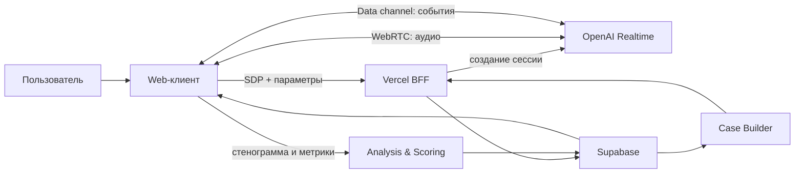

# Архитектура «Полигона»

Статус: проектное решение v0.2. Оригинал книги Владимира Тарасова получен и сохранён локально; следующий методический этап — извлечение, атомарная разметка и экспертная верификация. Цель первого прототипа — доказать низкую задержку двусторонней голосовой тренировки.

## 1. Продуктовая модель

Пользователь создаёт «проект» — набор реальных обстоятельств, людей, интересов, ограничений и документов. Система строит из этого учебные кейсы, назначает пользователю и ИИ роли, проводит голосовой управленческий поединок, а затем отдельно оценивает решения по проверенной методической базе.

В продукте принципиально разделены три режима:

1. **Подготовка** — разбор контекста проекта, генерация и проверка кейса, постановка ролей и скрытых интересов.
2. **Поединок** — максимально быстрый живой голосовой разговор. Здесь приоритет — естественный темп, перебивание и устойчивость роли.
3. **Разбор** — более медленный и глубокий анализ стенограммы, стратагем, поворотных моментов, альтернатив и оценки по рубрике.

Такое разделение не заставляет голосовую модель одновременно искать по большой базе и строить подробный отчёт, что иначе ухудшило бы задержку.

## 2. Рекомендуемый стек

| Слой | Решение | Назначение |
|---|---|---|
| Web | Next.js + TypeScript | интерфейс, серверные маршруты, авторизация |
| Hosting | Vercel | HTTPS, preview/production deploy, serverless endpoints |
| Live voice | OpenAI `gpt-realtime-2`, WebRTC | двусторонний голос, VAD, перебивание, короткие реплики |
| Server integrations | WebSocket при необходимости | телефония, серверная запись/модерация, внешние медиашлюзы |
| Deep analysis | OpenAI Responses API, reasoning model | построение кейса и пост-анализ по методике |
| Data | Supabase Postgres | пользователи, проекты, кейсы, сессии, оценки |
| Retrieval | Supabase pgvector | книга, методические атомы и контекст проекта |
| Files | Supabase Storage | книга, документы проектов, аудио при явном согласии |
| Observability | Vercel Analytics/Logs + таблица метрик | задержка, ошибки, качество сессий |

Для браузера основной транспорт — **WebRTC**. Звук после установления соединения идёт напрямую между браузером и Realtime API. Сервер Vercel нужен при открытии сессии, чтобы применить настройки и не раскрывать постоянный OpenAI API key. WebSocket остаётся вторым транспортом для серверных каналов, но не нужен в критическом пути браузерного прототипа.

## 3. Компоненты

### Web-клиент

- редактор контекста проекта;
- конструктор кейса и выбор роли;
- `RTCPeerConnection` для микрофона и голоса модели;
- data channel для событий, расшифровки, tool calls и телеметрии;
- визуальный статус «слушает / думает / говорит»;
- замер задержки: конец речи → первый аудиофрагмент;
- экран разбора и сравнения нескольких попыток.

### BFF на Vercel

- проверяет пользователя и права на проект;
- получает компактный «пакет сессии»;
- создаёт Realtime call через `/v1/realtime/calls`;
- держит постоянный OpenAI key только на сервере;
- ограничивает длину/тип контекста, rate limit и дневной бюджет;
- принимает итоговые события и запускает асинхронный разбор.

### Case Builder

До голосовой сессии reasoning-модель получает:

- факты проекта и релевантные фрагменты документов;
- проверенные методические правила построения кейса;
- желаемую сложность и навык;
- историю тренировок пользователя.

Результат формируется в строгой схеме: открытая вводная, роли, приватные цели сторон, допустимые факты, эскалации, критерии завершения, контрольные точки и версия методики. Кейс проходит автоматические проверки на противоречия и, для первых релизов, ручное подтверждение автором курса.

### Realtime Session Orchestrator

Перед стартом он собирает короткий пакет, который помещается в инструкции сессии:

- персонаж и его речевой стиль;
- только нужные факты текущего кейса;
- скрытые цели и границы персонажа;
- правила темпа, перебивания и длины ответа;
- 3–7 ожидаемых поворотных точек.

Большую книгу не нужно отправлять в Realtime-контекст на каждую реплику. Для редких уточнений можно подключить функцию `retrieve_case_context`, но ответы на обычные реплики должны обходиться без сетевого tool call.

### Methodology Engine

Это не просто поиск по книге. Нужны два слоя:

1. **RAG-слой** — страницы/фрагменты книги с точной ссылкой на источник.
2. **Нормативный слой** — извлечённые атомарные правила, рубрики оценки, определения стратагем, признаки и контрпримеры. Каждый атом имеет источник, версию, статус проверки и комментарий методиста.

Любое утверждение в разборе должно ссылаться либо на проверенный методический атом, либо явно маркироваться как общая рекомендация модели. Это защищает продукт от «выдуманной методики».

### Analysis & Scoring

После сессии асинхронный анализатор получает стенограмму с тайм-кодами и событиями перебивания. Он выдаёт:

- хронологию поворотных моментов;
- обнаруженные действия и возможные стратагемы с уверенностью;
- факты «за» и «против» каждой классификации;
- оценку только по утверждённой рубрике;
- 2–3 альтернативных хода;
- персональную микро-тренировку на следующий запуск.

В интерфейсе модельная уверенность показывается отдельно от итогового балла. Спорные моменты пользователь или методист может переоценить — это станет датасетом для evals.

## 4. Поток данных

## 5. Данные в Supabase

Основные таблицы:

- `profiles` — профиль, уровень, настройки приватности;
- `projects` — название и общий контекст;
- `project_members` — роли и доступ;
- `documents` — файл, тип, статус обработки, версия;
- `document_chunks` — фрагмент, embedding, источник и область видимости;
- `method_sources` — книга/редакция/диапазон страниц;
- `method_atoms` — правило, стратагема, критерий, пример, статус проверки;
- `cases` — открытая часть, скрытая модель ролей, версия;
- `case_facts` — факты с видимостью для каждой стороны;
- `sessions` — участник, кейс, модель, параметры, итог;
- `turns` — реплики, автор, тайм-коды, прерывания;
- `session_metrics` — p50/p95 задержки и технические ошибки;
- `evaluations` — версия рубрики, баллы, аргументы, уверенность;
- `evaluation_evidence` — связь вывода с репликой и методическим источником.

Row Level Security обязателен: пользователь видит только свои проекты; скрытая часть роли не выдаётся клиенту до завершения; service role key никогда не попадает в браузер.

## 6. Подготовка книги и RAG

1. Загрузить полученный оригинал из локальной закрытой папки в приватный Supabase Storage (не в публичный GitHub).
2. Извлечь текст с сохранением страниц, заголовков и примеров.
3. Разбить по смысловым границам, а не только по числу токенов.
4. Построить embeddings и сохранить исходную цитируемую позицию.
5. Отдельным проходом извлечь кандидаты в методические атомы.
6. Методист подтверждает/исправляет каждый атом.
7. Заморозить `methodology_version` и прогнать набор эталонных кейсов.
8. Только после этого включать автоматическое выставление баллов пользователям.

Книга подходит для RAG, но **одного RAG недостаточно** для стабильной оценки. Рубрика должна быть структурированной и версионируемой.

## 7. Задержка и критерий успеха прототипа

Измеряются не субъективные «зависания», а четыре величины:

- время установки сессии;
- конец речи пользователя → первый байт/дельта ответа;
- конец речи → первый слышимый звук;
- число ложных окончаний реплики и неудачных перебиваний.

Начальная цель для хорошей сети: медиана первого слышимого ответа до 900 мс, p95 до 1.8 с. Это продуктовая гипотеза, не гарантия API; её нужно проверить на реальных ноутбуках, телефонах, микрофонах и сетях. Для быстрого режима используются короткие ответы, `semantic_vad`, минимальная задержка расшифровки и low reasoning. Более глубокий анализ выполняется после разговора.

## 8. Безопасность и приватность

- постоянные API keys только в Vercel Environment Variables;
- согласие на запись до первой сессии;
- по умолчанию хранить стенограмму, а не аудио; аудио — опционально и с TTL;
- удаление проекта каскадно удаляет его документы и embeddings;
- нейтральный safety identifier на базе хеша внутреннего user id;
- защита endpoint сессии авторизацией, rate limiting и квотами;
- защита от prompt injection в документах: факты проекта считаются данными, а не инструкциями;
- журнал версий промпта, модели, кейса и рубрики для воспроизводимости оценки.

## 9. Этапы разработки

### P0 — доказательство голоса

Текущий прототип: WebRTC, `gpt-realtime-2`, русский голос, перебивание, transcript и измерение задержки. Критерий выхода — 20 тестовых разговоров без критических обрывов и с приемлемой p50/p95.

### P1 — вертикальный MVP

Supabase Auth, проекты, один тип кейса, загрузка книги, ручная верификация 30–50 методических атомов, сохранение сессии и пост-разбор.

### P2 — качество методики

Конструктор кейсов, полная рубрика, набор эталонных поединков, слепая разметка двумя экспертами, измерение согласия экспертов и модели.

### P3 — продукт

История прогресса, персональные задания, командные пространства, бюджеты, админка методиста, экспорт отчётов и A/B промптов.

## 10. Решения, которые нужны от владельца продукта

1. Какую именно книгу/редакцию и дополнительные материалы вы предоставите? Есть ли право использовать их в коммерческом продукте?
2. Кто будет методическим экспертом и сможет подтвердить извлечённые правила и спорные оценки?
3. Основной пользователь — руководитель, продавец, предприниматель или корпоративная группа?
4. Нужны только тренировки с ИИ или также поединки человек-человек и судейство?
5. Можно ли хранить полные стенограммы и аудио, и какой срок хранения допустим?
6. Какие реальные проектные документы будут загружаться: текст, PDF, Word, таблицы, ссылки?
7. Нужна ли организация с несколькими участниками и разграничением доступа уже в MVP?
8. Что считается доказательством «быстро»: целевой p50/p95, устройство и география теста?
