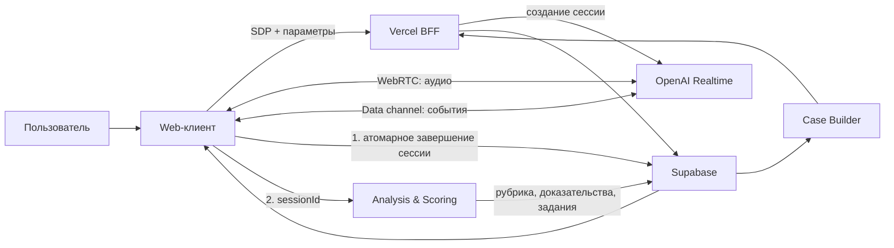

# Архитектура «Полигона»

Статус: реализация v0.8. Документ явно разделяет работающий production-контур и целевую модель. Голосовой прототип, библиотека кейсов, AI-конструктор, корпоративная регистрация, персональная статистика, SQL-рейтинг, учебный цикл, согласие и сроки хранения стенограмм реализованы. Пункты с пометкой «целевая модель» или «гипотеза» не следует считать существующими сущностями.

## 1. Продуктовая модель

Пользователь создаёт черновик кейса (`case_workspace`) — набор реальных обстоятельств и документов. Система строит из него учебные варианты, после утверждения публикует канонический кейс, назначает пользователю и ИИ роли, проводит голосовой управленческий поединок, а затем отдельно оценивает решения по проверенной методической базе. Многопользовательские «проекты» с участниками и общими документами остаются целевой моделью и в текущей схеме отсутствуют.

В продукте принципиально разделены три режима:

1. **Подготовка** — разбор контекста проекта, генерация и проверка кейса, постановка ролей и скрытых интересов.
2. **Поединок** — максимально быстрый живой голосовой разговор. Здесь приоритет — естественный темп, перебивание и устойчивость роли.
3. **Разбор** — более медленный и глубокий анализ стенограммы, стратагем, поворотных моментов, альтернатив и оценки по рубрике.

Такое разделение не заставляет голосовую модель одновременно искать по большой базе и строить подробный отчёт, что иначе ухудшило бы задержку.

## 2. Реализованный стек

| Слой | Решение | Назначение |
|---|---|---|
| Web | Next.js + TypeScript | интерфейс, серверные маршруты, авторизация |
| Hosting | Vercel | HTTPS, preview/production deploy, serverless endpoints |
| Live voice | OpenAI `gpt-realtime-2`, WebRTC | двусторонний голос, VAD, перебивание, короткие реплики |
| Deep analysis | OpenAI Responses API, reasoning model | построение кейса и пост-анализ по методике |
| Data | Supabase Postgres | пользователи, проекты, кейсы, сессии, оценки |
| Retrieval | Supabase pgvector | книга, методические атомы и контекст проекта |
| Files | Supabase Storage | книга, материалы кейсов, изображения и озвучка пролога |
| Observability | Vercel Analytics/Logs + таблица метрик | задержка, ошибки, качество сессий |

Для браузера основной транспорт — **WebRTC**. Звук после установления соединения идёт напрямую между браузером и Realtime API. Сервер Vercel нужен при открытии сессии, чтобы применить настройки и не раскрывать постоянный OpenAI API key. Телефония, серверная запись и внешние медиашлюзы через WebSocket — целевая модель, не текущая реализация.

## 3. Компоненты: реализовано и целевая модель

### Web-клиент — реализовано

- конструктор черновика кейса;
- конструктор кейса и выбор роли;
- `RTCPeerConnection` для микрофона и голоса модели;
- data channel для событий, расшифровки, tool calls и телеметрии;
- визуальный статус «слушает / думает / говорит»;
- замер задержки: конец речи → первый аудиофрагмент;
- экран разбора, история попыток и сравнение с предыдущей релевантной сессией.

### BFF на Vercel — реализовано, кроме отмеченного

- проверяет пользователя и права на черновик/кейс;
- получает компактный «пакет сессии»;
- создаёт Realtime call через `/v1/realtime/calls`;
- держит постоянный OpenAI key только на сервере;
- ограничивает длину/тип контекста; rate limit и дневной бюджет пока не реализованы;
- принимает итоговые события и запускает асинхронный разбор.

### Case Builder

До голосовой сессии reasoning-модель получает:

- факты проекта и релевантные фрагменты документов;
- проверенные методические правила построения кейса;
- желаемую сложность и навык;
- историю тренировок пользователя.

Результат формируется в строгой схеме: открытая вводная, роли, приватные цели сторон, допустимые факты, эскалации, критерии завершения, контрольные точки и версия методики. Кейс проходит автоматические проверки на противоречия и, для первых релизов, ручное подтверждение автором курса.

### Realtime Session Orchestrator

Перед стартом он собирает короткий пакет, который помещается в инструкции сессии:

- персонаж и его речевой стиль;
- только нужные факты текущего кейса;
- скрытые цели и границы персонажа;
- правила темпа, перебивания и длины ответа;
- 3–7 ожидаемых поворотных точек.

Большую книгу не нужно отправлять в Realtime-контекст на каждую реплику. Для редких уточнений можно подключить функцию `retrieve_case_context`, но ответы на обычные реплики должны обходиться без сетевого tool call.

### Methodology Engine

Это не просто поиск по книге. Нужны два слоя:

1. **RAG-слой** — страницы/фрагменты книги с точной ссылкой на источник.
2. **Нормативный слой** — извлечённые атомарные правила, рубрики оценки, определения стратагем, признаки и контрпримеры. Каждый атом имеет источник, версию, статус проверки и комментарий методиста.

Любое утверждение в разборе должно ссылаться либо на проверенный методический атом, либо явно маркироваться как общая рекомендация модели. Это защищает продукт от «выдуманной методики».

### Analysis & Scoring

После сессии асинхронный анализатор получает стенограмму с тайм-кодами и событиями перебивания. Он выдаёт:

- хронологию поворотных моментов;
- обнаруженные действия и возможные стратагемы с уверенностью;
- факты «за» и «против» каждой классификации;
- оценку только по утверждённой рубрике;
- 2–3 альтернативных хода;
- персональную микро-тренировку на следующий запуск.

В интерфейсе модельная уверенность показывается отдельно от итогового балла. Спорные моменты пользователь или методист может переоценить — это станет датасетом для evals.

## 4. Поток данных

```mermaid
flowchart LR
  U["Пользователь"] --> W["Web-клиент"]
  W -->|"SDP + параметры"| B["Vercel BFF"]
  B -->|"создание сессии"| R["OpenAI Realtime"]
  W <-->|"WebRTC: аудио"| R
  W <-->|"Data channel: события"| R
  B --> S["Supabase"]
  S --> C["Case Builder"]
  C --> B
  W -->|"1. атомарное завершение сессии"| S
  W -->|"2. sessionId"| A["Analysis & Scoring"]
  A -->|"рубрика, доказательства, задания"| S
  S --> W
```

## 5. Данные в Supabase

### Реализованный контур кейсов

- `case_workspaces` — накапливаемый черновик конструктора с текстовым описанием и статусом;
- `case_materials` — метаданные оригинальных файлов, закрытый путь в Storage и извлечённый текст;
- `case_variants` — 2–3 структурированных сценария, предложенных при каждом запуске анализа;
- `negotiation_cases` — утверждённые канонические кейсы, доступные в выпадающем списке тренажёра;
- `training_sessions.case_id` — связь завершённого поединка с выбранным опубликованным кейсом;
- закрытый Storage bucket `case-materials` — оригиналы TXT/MD/CSV/JSON/XML/HTML/RTF/PDF/DOCX.

Канонический кейс хранит ситуацию, центральный конфликт, две персонифицированные стороны, публичные и скрытые параметры ролей, интересы, ограничения, рычаги, ставки, стартовую позицию, причину сложности, критерии оценки и ссылки на методические атомы. Для каждой стороны `name` обязательно содержит минимум имя и фамилию; должность и организационная роль записываются отдельно в `position`, а `voiceGender` (`female`/`male`) задаёт голос персонажа. Это требование одновременно присутствует в промпте, строгой JSON Schema и проверке перед публикацией. Безымянный вариант или обозначение вида «руководитель проекта» вместо ФИО не считается каноническим и не может попасть в `negotiation_cases`. При выборе роли клиент берёт `voiceGender` противоположной стороны и автоматически выбирает голос ИИ. Ручное переопределение хранится в памяти отдельно по имени ИИ-персонажа: оно восстанавливается при возвращении к этому персонажу, но не переносится на другого оппонента. Скрытые мотивы используются серверным Realtime-промптом и не показываются участнику как готовый ответ.

Поток создания: `/cases` или быстрая загрузка → извлечение текста → закрытое сохранение оригиналов → Responses API со строгой JSON Schema и проверенными атомами `case_rule`/`principle`/`stratagem` → варианты → утверждение → `negotiation_cases` → выбор в `VoiceArena`.

### Целевая модель данных — не реализована

Следующие имена описывают возможное развитие совместных проектов и не являются текущими таблицами:

- `profiles` — профиль, уровень, настройки приватности;
- `projects` — название и общий контекст;
- `project_members` — роли и доступ;
- `documents` — файл, тип, статус обработки, версия;
- `document_chunks` — фрагмент, embedding, источник и область видимости;
- `method_sources` — книга/редакция/диапазон страниц;
- `method_atoms` — правило, стратагема, критерий, пример, статус проверки;
- `cases` — открытая часть, скрытая модель ролей, версия;
- `case_facts` — факты с видимостью для каждой стороны;
- `sessions` — участник, кейс, модель, параметры, итог;
- `turns` — реплики, автор, тайм-коды, прерывания;
- `session_metrics` — p50/p95 задержки и технические ошибки;
- `evaluations` — версия рубрики, баллы, аргументы, уверенность;
- `evaluation_evidence` — связь вывода с репликой и методическим источником.
- `user_learning_goals` — выбранный навык и наблюдаемая цель следующей тренировки;
- `practice_tasks` — упражнения из разбора со статусом выполнения.

В реализованном контуре сервер проверяет владельца `case_workspaces` и приватных `negotiation_cases`; скрытые мотивы не выдаются публичным API, а service role key никогда не попадает в браузер. Политики прямого клиентского доступа через RLS остаются целевой моделью: браузер работает через BFF.

## 6. Подготовка книги и RAG

1. Загрузить полученный оригинал из локальной закрытой папки в приватный Supabase Storage (не в публичный GitHub).
2. Извлечь текст с сохранением страниц, заголовков и примеров.
3. Разбить по смысловым границам, а не только по числу токенов.
4. Построить embeddings и сохранить исходную цитируемую позицию.
5. Отдельным проходом извлечь кандидаты в методические атомы.
6. Методист подтверждает/исправляет каждый атом.
7. Заморозить `methodology_version` и прогнать набор эталонных кейсов.
8. Только после этого включать автоматическое выставление баллов пользователям.

Книга подходит для RAG, но **одного RAG недостаточно** для стабильной оценки. Рубрика должна быть структурированной и версионируемой.

## 7. Задержка и критерий успеха прототипа

Измеряются не субъективные «зависания», а четыре величины:

- время установки сессии;
- конец речи пользователя → первый байт/дельта ответа;
- конец речи → первый слышимый звук;
- число ложных окончаний реплики и неудачных перебиваний.

Начальная цель для хорошей сети: медиана первого слышимого ответа до 900 мс, p95 до 1.8 с. Это продуктовая гипотеза, не гарантия API; её нужно проверить на реальных ноутбуках, телефонах, микрофонах и сетях. Для быстрого режима используются короткие ответы, `semantic_vad`, минимальная задержка расшифровки и low reasoning. Более глубокий анализ выполняется после разговора.

## 8. Безопасность и приватность

- постоянные API keys только в Vercel Environment Variables;
- явное согласие на сохранение стенограммы обязательно до создания новой сессии;
- аудио переговоров не сохраняется; пользователь выбирает срок хранения текста и учебных данных: 30, 90, 180, 365 или 730 дней;
- дата удаления фиксируется в `training_sessions.retention_expires_at`, фоновая задача каскадно удаляет просроченную сессию, стенограмму, оценку и метрики;
- личный кабинет предоставляет JSON-экспорт и немедленное удаление всех учебных сессий пользователя;
- удаление проекта каскадно удаляет его документы и embeddings;
- нейтральный safety identifier на базе хеша внутреннего user id;
- защита endpoint сессии авторизацией, rate limiting и квотами;
- защита от prompt injection в документах: факты проекта считаются данными, а не инструкциями;
- журнал версий промпта, модели, кейса и рубрики для воспроизводимости оценки.

## 9. Реализованные этапы и дальнейшие гипотезы

### Комикс-пролог к кейсу — реализовано

В прототипе реализован проигрыватель комикс-пролога и эталонная история из четырёх кадров для кейса «Сорванный срок проекта». `getCaseComic` связывает версию кейса с изображениями, заголовками, отдельным текстом и заранее подготовленными дорожками `marin`/`cedar` каждой сцены. Клиент предзагружает весь выбранный голос при открытии окна и после окончания аудио переключает кадр без повторного обращения к Speech API. `/api/cases/narration` с `panelIndex` остаётся генератором дорожек при подготовке пакета. Полное каноническое описание доступно из того же окна.

Автоматическое производство включено для обоих путей публикации: быстрой загрузки готового кейса и утверждения варианта из конструктора. HTTP-запрос только ставит постоянное задание в `case_media_jobs`; GitHub Actions каждые пять минут вызывает защищённый `/api/cron/case-media`, а ежедневный Vercel Cron остаётся резервным запуском в рамках Hobby-тарифа. Воркер обрабатывает до двух кейсов за вызов. Изображения выполняются с параллельностью 2, озвучка — с параллельностью 3. Каждая попытка получает `generation_id`; `case_media_jobs` хранит число попыток, время следующего запуска и последнюю полностью опубликованную генерацию. Ошибки переводятся в повтор с экспоненциальной задержкой, максимум четыре попытки. Клиент видит только опубликованный пакет, поэтому частичный результат не заменяет рабочий. Параллельный запуск блокируется атомарным claim RPC, зависшая попытка перехватывается после десятиминутного lease. Бинарные WEBP/MP3 хранятся в закрытом bucket `case-comics`, клиент получает только часовые signed URLs.

### Надёжность пост-анализа и учебный цикл

Серверная `training_sessions` создаётся до открытия голосового канала. Завершение разделено на два шага: сначала `finalize_training_session` одной транзакцией заменяет реплики, сохраняет нормализованные метрики и переводит запись в `analysis_pending`; только после успешного ответа клиент передаёт `sessionId` анализатору. `claim_training_analysis` выдаёт единственный пятиминутный lease, а уникальность `evaluations.session_id` делает повторный вызов идемпотентным. При отказе модели сессия остаётся в `analysis_failed`, доступна в истории и может быть повторно проанализирована.

Итоговая оценка состоит ровно из пяти серверных критериев по 20 баллов: продвижение к цели, разведка интересов, управление ходом разговора, аргументация/обмены и качество договорённостей. Сервер ограничивает каждый балл и пересчитывает сумму независимо от ответа модели. Отчёт хранит и показывает отдельную уверенность, проверенные цитаты, поворотные моменты и стратагемы. `practice_tasks` замыкают разбор в конкретные упражнения, а `user_learning_goals` добавляют выбранный фокус в снимок следующей тренировки.

### Расширенная визуальная режиссура — целевая модель

Комикс не должен генерироваться при каждом открытии страницы и задерживать начало переговоров. Следующие пункты описывают дальнейшее развитие текущего асинхронного конвейера:

1. Канонический кейс преобразуется в строго типизированную раскадровку: завязка, представление сторон, проявление конфликта, ставки и точка входа в поединок. Подписи строятся только из публичных фактов; скрытые мотивы в пролог не попадают.
2. Для действующих лиц создаётся «библия персонажей»: постоянный идентификатор, внешность, одежда, цветовая палитра, окружение и референсное изображение. Это обеспечивает визуальную последовательность между кадрами.
3. Генератор изображений создаёт кадры без встроенного текста. Заголовки, реплики и субтитры накладываются интерфейсом, поэтому русский текст остаётся читаемым, доступным и легко редактируется.
4. Отдельная проверка сопоставляет каждый кадр с раскадровкой и референсами персонажей. Кадры с перепутанными ролями, фактами или внешностью отправляются на повторную генерацию.
5. Готовая история хранится по версии канонического кейса и показывается перед стартом как перелистываемая лента. Обе голосовые версии каждой сцены генерируются в той же фоновой задаче, сохраняются рядом с изображениями и публикуются только после готовности всего пакета. Пользователь всегда может пропустить пролог.

Предлагаемые сущности: `case_storyboards` (кейс, версия, статус, модель, сценарий), `case_storyboard_characters` (визуальные паспорта персонажей) и `case_storyboard_panels` (порядок, подпись, промпт, путь к изображению, длительность, статус проверки). Изображения размещаются в закрытом bucket `case-comics`, а клиент получает только короткоживущие ссылки. Повторная генерация запускается при изменении версии кейса, а не при каждом просмотре. В производственном контуре нужны очередь фоновых заданий, лимиты стоимости, журнал моделей и промптов, а также ручное утверждение истории перед публикацией.

### P0 — доказательство голоса

Текущий прототип: WebRTC, `gpt-realtime-2`, русский голос, перебивание, transcript и измерение задержки. Критерий выхода — 20 тестовых разговоров без критических обрывов и с приемлемой p50/p95.

### P1 — вертикальный MVP

Supabase Auth, корпоративные профили, владельцы кейсов, серверное сохранение сессии до анализа, фиксированная рубрика, личный кабинет, история отчётов, цели, задания, рейтинг и постоянная очередь медиапакетов реализованы. Эксплуатационная проверка на эталонном наборе и экспертная верификация расширенного набора атомов продолжаются как контроль качества методики.

### P2 — качество методики

Конструктор кейсов, полная рубрика, набор эталонных поединков, слепая разметка двумя экспертами, измерение согласия экспертов и модели.

### P3 — продукт

История прогресса и персональные задания реализованы. Следующий продуктовый этап: командные пространства, бюджеты, экспорт отчётов и A/B-прогоны промптов.

## 10. Решения, которые нужны от владельца продукта

1. Какую именно книгу/редакцию и дополнительные материалы вы предоставите? Есть ли право использовать их в коммерческом продукте?
2. Кто будет методическим экспертом и сможет подтвердить извлечённые правила и спорные оценки?
3. Основной пользователь — руководитель, продавец, предприниматель или корпоративная группа?
4. Нужны только тренировки с ИИ или также поединки человек-человек и судейство?
5. Можно ли хранить полные стенограммы и аудио, и какой срок хранения допустим?
6. Какие реальные проектные документы будут загружаться: текст, PDF, Word, таблицы, ссылки?
7. Нужна ли организация с несколькими участниками и разграничением доступа уже в MVP?
8. Что считается доказательством «быстро»: целевой p50/p95, устройство и география теста?
